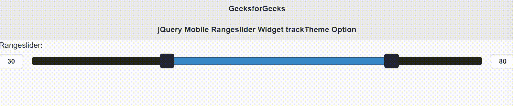

# jquery mobile range slider widget track theme option

> 原文:[https://www . geesforgeks . org/jquery-mobile-range slider-widget-track theme-option/](https://www.geeksforgeeks.org/jquery-mobile-rangeslider-widget-tracktheme-option/)

jQuery Mobile 是一种基于网络的技术，用于制作可在所有智能手机、平板电脑和台式机上访问的响应内容。在本文中，我们将使用 jQuery Mobile range slider Widget track theme 选项来设置滑块轨迹的配色方案(样本)，具体来说。它接受 a-z 中的一个字符来对主题进行采样。它接受字符串类型值，默认值为 null，从父级继承而来。

**语法:**

```
$( ".selector" ).rangeslider({
    trackTheme: string
});
```

**CDN 链接:**首先，添加项目所需的 jQuery Mobile 脚本。

> <link rel="”stylesheet”" href="”//code.jquery.com/mobile/1.4.5/jquery.mobile-1.4.5.min.css”">
> <脚本 src =//code . jquery . com/jquery-1 . 10 . 2 . min . js”></脚本>
> <脚本 src =//code . jquery . com/mobile/1 . 4 . 5/jquery . mobile-1 . 4 . 5 . min . js”></脚本>

**示例:**

## 超文本标记语言

```
<!doctype html>
<html lang="en">

<head>
    <meta charset="utf-8">
    <meta name="viewport" content=
        "width=device-width, initial-scale=1">

    <link rel="stylesheet" href=
"//code.jquery.com/mobile/1.4.5/jquery.mobile-1.4.5.min.css">

    <script src="//code.jquery.com/jquery-1.10.2.min.js">
    </script>

    <script src=
"//code.jquery.com/mobile/1.4.5/jquery.mobile-1.4.5.min.js">
    </script>

    <script>
        $(document).ready(function () {
            $("#GFG").rangeslider({
                trackTheme: "b"
            });
        });
    </script>
</head>

<body>
    <div data-role="page" id="page1">
        <div data-role="header">
            <h1>GeeksforGeeks</h1>
            <h3>
             jQuery Mobile Rangeslider Widget trackTheme Option
            </h3>
        </div>

        <div data-role="rangeslider" id="GFG">
            <label for="range-slider-1">Rangeslider:</label>
            <input name="range-slider-1" min="0" 
                max="100" value="30" type="range">

            <label for="range-slider-2">Rangeslider:</label>
            <input name="range-slider-2" min="0" 
                max="100" value="80" type="range">
        </div>
    </div>
</body>

</html>
```

**输出:**



**参考:**[https://API . jquerymobile . com/range slider/# option-track theme](https://api.jquerymobile.com/rangeslider/#option-trackTheme)