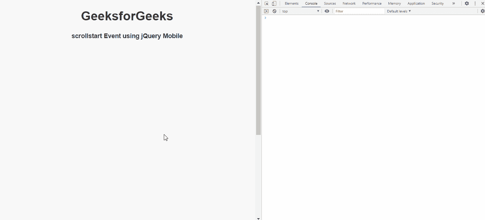
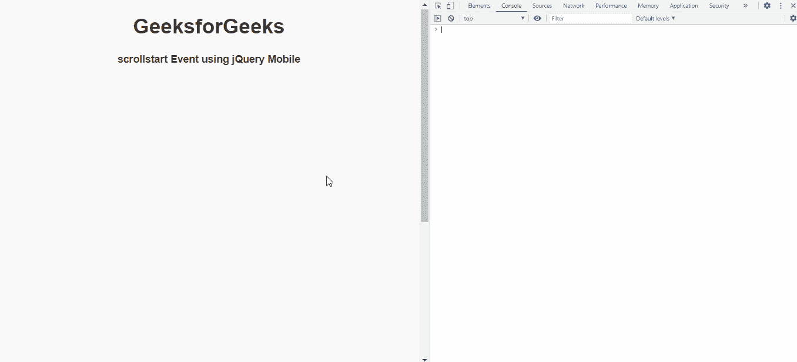

# jQuery 手机滚动启动事件

> 原文:[https://www . geesforgeks . org/jquery-mobile-scroll start-event/](https://www.geeksforgeeks.org/jquery-mobile-scrollstart-event/)

**jQuery Mobile** 是一种基于网络的技术，用于制作可在所有智能手机、平板电脑和台式机上访问的响应内容。每当滚动开始时，jQuery Mobile 中的*滚动开始*事件就会被触发。我们可以将这个事件用于不同的目的。

**语法:**

```html
jQuery(".selector").on("scrollstart", function( event ) {  })
```

**方法:**首先，添加项目所需的 jQuery Mobile 脚本。

> <link rel="”stylesheet”" href="”http://code.jquery.com/mobile/1.4.5/jquery.mobile-1.4.5.min.css”">
> <脚本 src = " http://code . jquery . com/jquery-1 . 11 . 1 . min . js "></脚本>
> <脚本 src = " http://code . jquery . com/mobile/1 . 4 . 5/jquery . mobile-1 . 4 . 5 . min . js "></脚本>

**例 1:**

## 超文本标记语言

```html
<!DOCTYPE html>
<html>

<head>
    <link rel="stylesheet" href=
"http://code.jquery.com/mobile/1.4.5/jquery.mobile-1.4.5.min.css" />

    <script src=
        "http://code.jquery.com/jquery-1.11.1.min.js">
    </script>

    <script src=
"http://code.jquery.com/mobile/1.4.5/jquery.mobile-1.4.5.min.js">
    </script>

    <script type="text/javascript">
        $(document).on('scrollstart', function() {
            console.log('scrollstart event fired');
        })
    </script>
</head>

<body>
    <center>
        <h1>GeeksforGeeks</h1>
        <h4>
            scrollstart Event using jQuery Mobile
        </h4>
    </center>
    <div style="height: 800px;"></div>
</body>

</html>
```

**输出:**



**例 2:**

## 超文本标记语言

```html
<!DOCTYPE html>
<html>

<head>
    <link rel="stylesheet" href=
"http://code.jquery.com/mobile/1.4.5/jquery.mobile-1.4.5.min.css" />

    <script src=
        "http://code.jquery.com/jquery-1.11.1.min.js">
    </script>

    <script src=
"http://code.jquery.com/mobile/1.4.5/jquery.mobile-1.4.5.min.js">
    </script>

    <script type="text/javascript">
        $(document).on('scrollstart', function(event) {
            console.log(event)
        })
    </script>
</head>

<body>
    <center>
        <h1>GeeksforGeeks</h1>
        <h4>
            scrollstart Event using jQuery Mobile
        </h4>
    </center>
    <div style="height: 800px;"></div>
</body>

</html>
```

**输出:**

