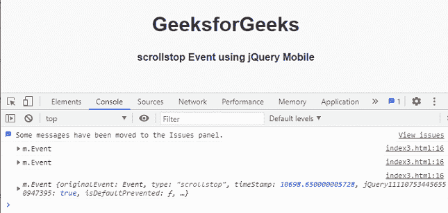

# jQuery 移动滚动停止事件

> 原文:[https://www . geesforgeks . org/jquery-mobile-scrollstop-event/](https://www.geeksforgeeks.org/jquery-mobile-scrollstop-event/)

**jQuery Mobile** *滚动*滚动完成时触发顶部事件。我们可以将这个事件用于不同的目的。

**语法:**

```html
jQuery( ".selector" ).on( "scrollstop", function( event ) {  } )
```

**方法:**首先，添加项目所需的 **jQuery Mobile** 脚本。

> <link rel="”stylesheet”" href="”http://code.jquery.com/mobile/1.4.5/jquery.mobile-1.4.5.min.css”">
> <脚本 src = " http://code . jquery . com/jquery-1 . 11 . 1 . min . js "></脚本>
> <脚本 src = " http://code . jquery . com/mobile/1 . 4 . 5/jquery . mobile-1 . 4 . 5 . min . js "></脚本>

**例 1:**

## 超文本标记语言

```html
<!DOCTYPE html>
<html>

<head>
    <link rel="stylesheet" href=
"http://code.jquery.com/mobile/1.4.5/jquery.mobile-1.4.5.min.css" />

    <script src=
        "http://code.jquery.com/jquery-1.11.1.min.js">
    </script>

    <script src=
"http://code.jquery.com/mobile/1.4.5/jquery.mobile-1.4.5.min.js">
    </script>

    <script type="text/javascript">
        $(document).on('scrollstop', function(event) {
            console.log(event)
        })
    </script>
</head>

<body>
    <center>
        <h1>GeeksforGeeks</h1>
        <h4>scrollstop Event using jQuery Mobile</h4>
    </center>

    <br><br><br><br><br><br><br><br><br><br>
    <br><br><br><br><br><br><br><br><br><br>
    <br><br><br><br><br><br><br><br><br><br>
    <br><br><br><br><br><br><br><br><br><br>
</body>

</html>
```

**输出:**

 

**例 2:**

## 超文本标记语言

```html
<!DOCTYPE html>
<html>

<head>
    <link rel="stylesheet" href=
"http://code.jquery.com/mobile/1.4.5/jquery.mobile-1.4.5.min.css" />

    <script src=
        "http://code.jquery.com/jquery-1.11.1.min.js">
    </script>

    <script src=
"http://code.jquery.com/mobile/1.4.5/jquery.mobile-1.4.5.min.js">
    </script>

    <script type="text/javascript">
        $(document).on('scrollstop', function() {
            console.log('scrollstop event fired');
        })
    </script>
</head>

<body>
    <center>
        <h1>GeeksforGeeks</h1>
        <h4>scrollstop Event using jQuery Mobile</h4>
    </center>

    <br><br><br><br><br><br><br><br><br><br>
    <br><br><br><br><br><br><br><br><br><br>
    <br><br><br><br><br><br><br><br><br><br>
    <br><br><br><br><br><br><br><br><br><br>
</body>

</html>
```

**输出:**

 