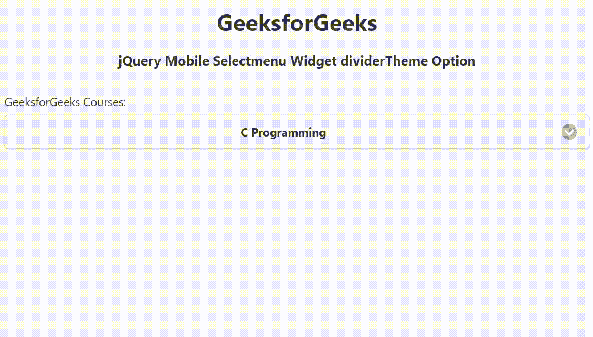

# jquery mobile select menu widget dividerteme 选项

> 原文:[https://www . geesforgeks . org/jquery-mobile-selectmenu-widget-divider theme-option/](https://www.geeksforgeeks.org/jquery-mobile-selectmenu-widget-dividertheme-option/)

jQuery Mobile 是一种基于网络的技术，用于制作可在所有智能手机、平板电脑和台式机上访问的响应内容。在本文中，我们将使用 jQuery Mobile Selectmenu Widget divider theme 选项为表示 optgroup 标题的 listview 分隔线设置配色方案。它接受从 a-z 映射到主题中包含的样本的单个字符。它接受字符串类型值，默认值为 null，从父级继承而来。

**语法:**

```
$( ".selector" ).selectmenu({
    dividerTheme: string
});
```

**CDN 链接:**首先，添加项目所需的 jQuery Mobile 脚本。

> <脚本 src = "//code . jquery . com/jquery-3 . 2 . 1min . js "></脚本><脚本 src = "//code . jquery . com/mobile/1 . 5 . 0-alpha . 1/jquery . mobile-1 . 5 . 0-alpha

**示例:**

## 超文本标记语言

```
<!doctype html>
<html lang="en">

<head>
    <meta charset="utf-8">
    <meta name="viewport" content="width=device-width, initial-scale=1">

    <link rel="stylesheet" href=
"//code.jquery.com/mobile/1.5.0-alpha.1/jquery.mobile-1.5.0-alpha.1.min.css">
    <script src="//code.jquery.com/jquery-3.2.1.min.js"></script>
    <script src=
"//code.jquery.com/mobile/1.5.0-alpha.1/jquery.mobile-1.5.0-alpha.1.min.js">
    </script>

    <script>
        $(document).ready(function () {
            $("#GFG").selectmenu({
                dividerTheme: "a"
            });
        });
    </script>
</head>

<body>
    <div data-role="page" id="page1">
        <center>
            <div data-role="header">
                <h1>GeeksforGeeks</h1>
                <h3>jQuery Mobile Selectmenu Widget dividerTheme Option</h3>
            </div>
        </center>

        <div role="main" class="ui-content">
            <label for="GFG" class="select">
                GeeksforGeeks Courses:
            </label>
            <select name="GFG" id="GFG">
                <optgroup label="Programming Languages">
                    <option value="C">C Programming</option>
                    <option value="CPP">C++ Programming</option>
                    <option value="JAVA">Java Programming</option>
                    <option value="overnight">Python Programming</option>
                </optgroup>
                <optgroup label="Web Development">
                    <option value="HTML">HTML</option>
                    <option value="CSS">CSS</option>
                    <option value="JS">JavaScript</option>
                </optgroup>
            </select>
        </div>
    </div>
</body>

</html>
```

**输出:**



**参考:**[https://API . jquerymobile . com/select menu/# option-dividerteme](https://api.jquerymobile.com/selectmenu/#option-dividerTheme)