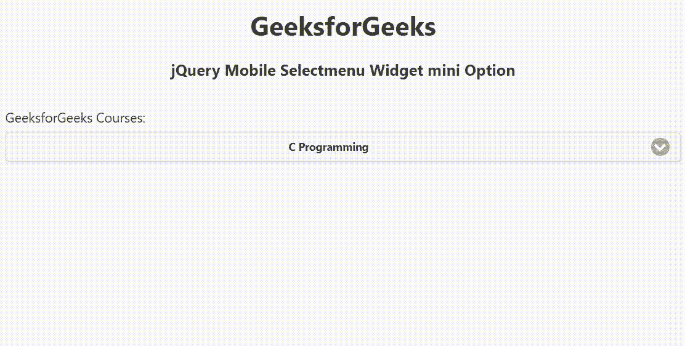

# jquery mobile select menu widget mini option

> 哎哎哎:# t0]https://www . geeksforgeeks . org/jquery-mobile-selectmenu 小部件迷你选项/

jQuery Mobile 是一种基于网络的技术，用于制作可在所有智能手机、平板电脑和台式机上访问的响应内容。在本文中，我们将使用 jQuery Mobile Selectmenu Widget 迷你选项来将元素的大小设置为更紧凑的迷你版本。它接受布尔值，默认值为 false。

**语法:**

```html
$( ".selector" ).selectmenu({
    mini: boolean
});
```

**CDN 链接:**首先，添加项目所需的 jQuery Mobile 脚本。

> <脚本 src = "//code . jquery . com/jquery-3 . 2 . 1min . js "></脚本><脚本 src = "//code . jquery . com/mobile/1 . 5 . 0-alpha . 1/jquery . mobile-1 . 5 . 0-alpha

**示例:**

## 超文本标记语言

```html
<!doctype html>
<html lang="en">

<head>
    <meta charset="utf-8">
    <meta name="viewport" content="width=device-width, initial-scale=1">

    <link rel="stylesheet" href=
"//code.jquery.com/mobile/1.5.0-alpha.1/jquery.mobile-1.5.0-alpha.1.min.css">
    <script src="//code.jquery.com/jquery-3.2.1.min.js"></script>
    <script src=
"//code.jquery.com/mobile/1.5.0-alpha.1/jquery.mobile-1.5.0-alpha.1.min.js">
    </script>

    <script>
        $(document).ready(function () {
            $("#GFG").selectmenu({
                mini: true
            });
        });
    </script>
</head>

<body>
    <div data-role="page" id="page1">
        <center>
            <div data-role="header">
                <h1>GeeksforGeeks</h1>
                <h3>jQuery Mobile Selectmenu Widget mini Option</h3>
            </div>
        </center>

        <div role="main" class="ui-content">
            <label for="GFG" class="select">
                GeeksforGeeks Courses:
            </label>
            <select name="GFG" id="GFG">
                <option value="C">C Programming</option>
                <option value="CPP">C++ Programming</option>
                <option value="JAVA">Java Programming</option>
                <option value="overnight">Python Programming</option>
                <option value="WEB">Web Development</option>
            </select>
        </div>
    </div>
</body>

</html>
```

**输出:**



**参考:**[https://API . jquerymobile . com/select menu/# option-mini](https://api.jquerymobile.com/selectmenu/#option-mini)