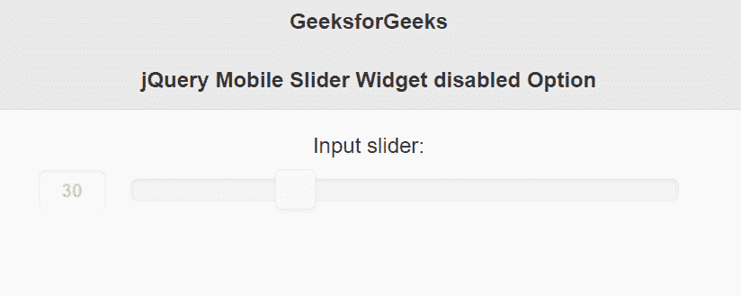

# jQuery 移动滑块小部件禁用选项

> 原文:[https://www . geesforgeks . org/jquery-mobile-slider-widget-disabled-option/](https://www.geeksforgeeks.org/jquery-mobile-slider-widget-disabled-option/)

jQuery Mobile 是一种基于网络的技术，用于制作可在所有智能手机、平板电脑和台式机上访问的响应内容。
在本文中，我们将使用 jQuery Mobile Slider 小部件*禁用*选项来禁用滑块，如果其值设置为 *true* 。接受布尔类型值，默认值为*假*。

**语法:**

```
$( ".selector" ).slider({
    disabled: boolean
});
```

**CDN 链接:**首先，添加项目所需的 jQuery Mobile 脚本。

> <link rel="”stylesheet”" href="”//code.jquery.com/mobile/1.4.5/jquery.mobile-1.4.5.min.css”">
> <脚本 src =//code . jquery . com/jquery-1 . 10 . 2 . min . js”></脚本>
> <脚本 src =//code . jquery . com/mobile/1 . 4 . 5/jquery . mobile-1 . 4 . 5 . min . js”></脚本>

**示例:**

## 超文本标记语言

```
<!doctype html>
<html lang="en">

<head>
    <meta charset="utf-8">
    <meta name="viewport" content=
        "width=device-width, initial-scale=1">

    <link rel="stylesheet" href=
"//code.jquery.com/mobile/1.4.5/jquery.mobile-1.4.5.min.css">

    <script src="//code.jquery.com/jquery-1.10.2.min.js">
    </script>

    <script src=
"//code.jquery.com/mobile/1.4.5/jquery.mobile-1.4.5.min.js">
    </script>

    <script>
        $(document).ready(function () {
            $("#GFG").slider({
                disabled: true
            });
        });
    </script>
</head>

<body>
    <div data-role="page" id="page1">
        <div data-role="header">
            <h1>GeeksforGeeks</h1>
            <h3>jQuery Mobile Slider Widget disabled Option</h3>
        </div>

        <center>
            <div role="main" class="ui-content" style="width: 50%;">
                <label for="slider">Input slider:</label>
                <input type="range" name="slider" 
                    id="GFG" min="0" max="100" value="30">
            </div>
        </center>
    </div>
</body>

</html>
```

**输出:**



**参考:**T2】https://api.jquerymobile.com/slider/#option-disabled