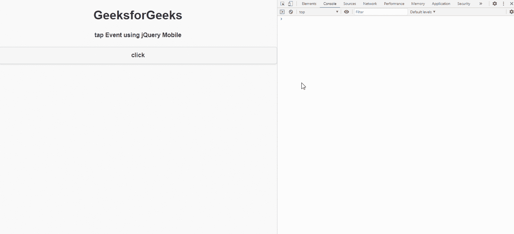
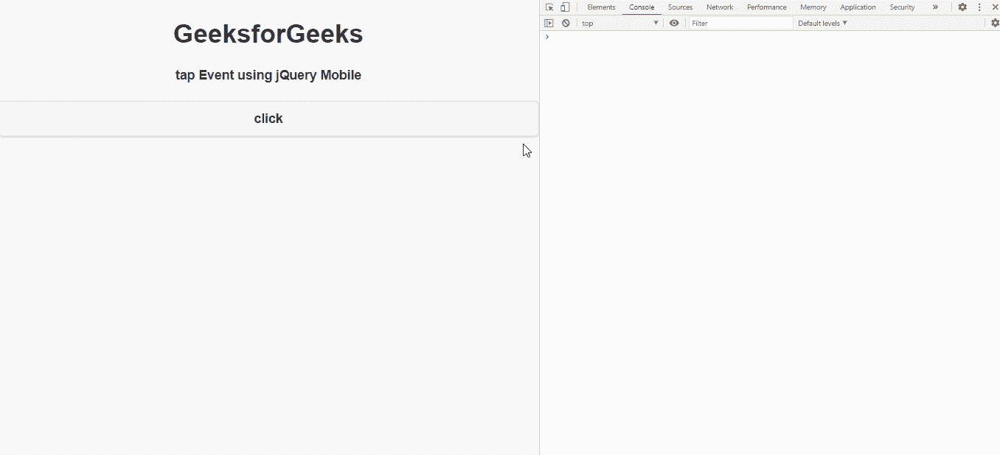

# jQuery 手机点击事件

> 原文:[https://www.geeksforgeeks.org/jquery-mobile-tap-event/](https://www.geeksforgeeks.org/jquery-mobile-tap-event/)

**jQuery Mobile** 是一种基于网络的技术，用于制作可在所有智能手机、平板电脑和台式机上访问的响应内容。jQuery Mobile 中的点击事件在元素区域接收到快速完整的触摸事件时触发。我们可以将这个事件用于不同的目的。

**语法:**

```html
jQuery(".selector").on("tap", function( event ) {  })
```

**方法:**首先，添加项目所需的 jQuery Mobile 脚本。

> <link rel="”stylesheet”" href="”http://code.jquery.com/mobile/1.4.5/jquery.mobile-1.4.5.min.css”">
> <脚本 src = " http://code . jquery . com/jquery-1 . 11 . 1 . min . js "></脚本>
> <脚本 src = " http://code . jquery . com/mobile/1 . 4 . 5/jquery . mobile-1 . 4 . 5 . min . js "></脚本>

**例 1:**

## 超文本标记语言

```html
<!DOCTYPE html>
<html>

<head>
    <link rel="stylesheet" href=
"http://code.jquery.com/mobile/1.4.5/jquery.mobile-1.4.5.min.css" />

    <script src=
        "http://code.jquery.com/jquery-1.11.1.min.js">
    </script>

    <script src=
"http://code.jquery.com/mobile/1.4.5/jquery.mobile-1.4.5.min.js">
    </script>

    <script type="text/javascript">
        $(document).on('tap', 'a',
            function(event) {
                console.log(event)
            })
    </script>
</head>

<body>
    <center>
        <h1>GeeksforGeeks</h1>
        <h4>tap Event using jQuery Mobile</h4>
    </center>
    <a data-role="button" id="gfg">click</a>
</body>

</html>
```

**输出:**



**例 2:**

## 超文本标记语言

```html
<!DOCTYPE html>
<html>

<head>
    <link rel="stylesheet" href=
"http://code.jquery.com/mobile/1.4.5/jquery.mobile-1.4.5.min.css" />

    <script src=
        "http://code.jquery.com/jquery-1.11.1.min.js">
    </script>

    <script src=
"http://code.jquery.com/mobile/1.4.5/jquery.mobile-1.4.5.min.js">
    </script>

    <script type="text/javascript">
        $(document).on('tap', 'a', function() {
            console.log('tap event fired');
        })
    </script>
</head>

<body>
    <center>
        <h1>GeeksforGeeks</h1>
        <h4>tap Event using jQuery Mobile</h4>
    </center>
    <a data-role="button" id="gfg">click</a>
</body>

</html>
```

**输出:**

