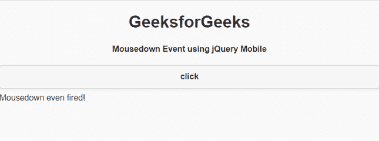

# jQuery Mobile vmousedown 事件

> 原文:[https://www . geesforgeks . org/jquery-mobile-vmousedown-event/](https://www.geeksforgeeks.org/jquery-mobile-vmousedown-event/)

**jQuery Mobile***vmousedown*事件在我们点击元素时被触发。我们可以将这个事件用于不同的目的。

**语法:**

```html
jQuery( ".selector" ).on( "vmousedown", function( event ) {  } )
```

**方法:**首先，添加项目所需的 jQuery Mobile 脚本。

> <link rel="”stylesheet”" href="”http://code.jquery.com/mobile/1.4.5/jquery.mobile-1.4.5.min.css”">
> <脚本 src = " http://code . jquery . com/jquery-1 . 11 . 1 . min . js "></脚本>
> <脚本 src = " http://code . jquery . com/mobile/1 . 4 . 5/jquery . mobile-1 . 4 . 5 . min . js "></脚本>

**例 1:**

## 超文本标记语言

```html
<!DOCTYPE html>
<html>

<head>
    <link rel="stylesheet" href=
"http://code.jquery.com/mobile/1.4.5/jquery.mobile-1.4.5.min.css" />

    <script src=
        "http://code.jquery.com/jquery-1.11.1.min.js">
    </script>

    <script src=
"http://code.jquery.com/mobile/1.4.5/jquery.mobile-1.4.5.min.js">
    </script>

    <script type="text/javascript">
        $(document).on('vmousedown', 'a', 
            function(event) {
            console.log(event)
        })
    </script>
</head>

<body>

    <center>
        <h1>GeeksforGeeks</h1>
        <h4>Mousedown Event using jQuery Mobile</h4>
    </center>

    <a data-role="button" id="gfg">click</a>

</body>

</html>
```

**输出:**

 

**例 2:**

## 超文本标记语言

```html
<!DOCTYPE html>
<html>

<head>
    <link rel="stylesheet" href=
"http://code.jquery.com/mobile/1.4.5/jquery.mobile-1.4.5.min.css" />

    <script src=
        "http://code.jquery.com/jquery-1.11.1.min.js">
    </script>

    <script src=
"http://code.jquery.com/mobile/1.4.5/jquery.mobile-1.4.5.min.js">
    </script>

    <script type="text/javascript">
        $(document).on('vmousedown', 'a', function() {
            console.log('Mousedown event fired');
        })
    </script>
</head>

<body>
    <center>
        <h1>GeeksforGeeks</h1>
        <h4>Mousedown Event using jQuery Mobile</h4>
    </center>

    <a data-role="button" id="gfg">click</a>
</body>

</html>
```

**输出:**

 