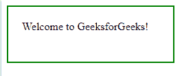
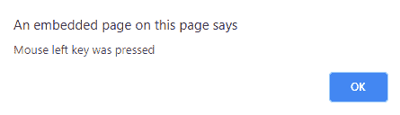

# jQuery | mousedown()带示例

> 原文:[https://www . geeksforgeeks . org/jquery-mouse down-with-examples/](https://www.geeksforgeeks.org/jquery-mousedown-with-examples/)

mousedown()方法是 jQuery 中的一个内置方法，当鼠标左键在选定的元素上按下时，该方法工作。
**语法:**

```html
$(selector).mousedown(function)
```

**参数:**该功能接受单参数*功能*，可选。它用于指定调用 mousedown 事件时要运行的函数。

**返回值:**该方法返回有变化的选中元素。

下面的例子说明了 jQuery 中的 mousedown()方法:

**示例:**

```html
<!DOCTYPE html>
<html>
    <head>
        <title>The mousedown Method</title>
        <script src=
        "https://ajax.googleapis.com/ajax/libs/jquery/3.3.1/jquery.min.js">
        </script>

        <!-- jQuery code to show the working of this method -->
        <script>
            $(document).ready(function() {
                $("div").mousedown(function() {
                    alert("Mouse left key was pressed");
                });
            });
        </script>
        <style>
            div {
                width: 200px;
                height: 40px;
                font-weight: bold;
                border: 2px solid green;
                padding: 20px;
            }
        </style>
    </head>
    <body>
        <!-- click on this button and pop up will appear-->
        <div>Welcome to GeeksforGeeks!</div>
    </body>
</html>
```

**输出:**
之前点击段落元素:
T5【之后点击段落元素:


**相关文章:**

*   [jQuery | on()带示例](https://www.geeksforgeeks.org/jquery-on-with-examples/)
*   [jQuery | first()带示例](https://www.geeksforgeeks.org/jquery-first-with-examples/)