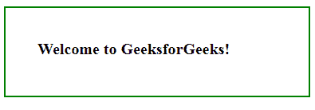
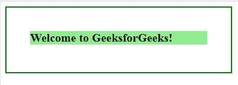

# jQuery | mouseleave()带示例

> 原文:[https://www . geeksforgeeks . org/jquery-mouse leave-with-examples/](https://www.geeksforgeeks.org/jquery-mouseleave-with-examples/)

mouseleave()方法是 jQuery 中的一个内置方法，当鼠标指针离开所选元素时，该方法会工作。

**语法:**

```html
$(selector).mouseleave(function)
```

**参数:**该方法接受单参数*功能*，可选。它用于指定调用 mouseleave 事件时要运行的函数。

**返回值:**该方法返回带有 mouseleave()方法所做更改的选定元素。

下面的例子说明了 jQuery 中的 mouseleave()方法:

**示例:**

```html
<!DOCTYPE html>
<html>
    <head>
        <title>The mouseleave Method</title>
        <script src=
        "https://ajax.googleapis.com/ajax/libs/jquery/3.3.1/jquery.min.js">
        </script>

        <!-- jQuery code to show the working of this method -->
        <script>
            $(document).ready(function() {
                $("p").mouseleave(function() {
                    $("p").css("background-color", "lightgreen");
                });
            });
        </script>
        <style>
            body {
                width: 300px;
                padding: 40px;
                height: 30px;
                border: 2px solid green;
                font-weight: bold;
                font-size: 20px;
            }
        </style>
    </head>

    <body>
        <!-- move over this paragraph and see the change -->
        <p>Welcome to GeeksforGeeks!</p>
    </body>
</html>
```

**输出:**
将鼠标移过段落前:
将鼠标移过段落后:
。


**相关文章:**

*   [jQuery | addBack()带示例](https://www.geeksforgeeks.org/jquery-addback-with-examples/)
*   [jQuery | addClass()带示例](https://www.geeksforgeeks.org/jquery-addclass-with-examples/)