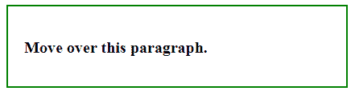
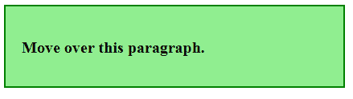

# jQuery | mousemove()带示例

> 原文:[https://www . geeksforgeeks . org/jquery-mouse move-with-examples/](https://www.geeksforgeeks.org/jquery-mousemove-with-examples/)

mousemove()方法是 jQuery 中的一个内置方法，当鼠标指针移动到所选元素上时使用。
**语法:**

```
$(selector).mousemove(function)
```

**参数:**该方法接受单参数*功能*，可选。此参数用于指定调用 mousemove 事件时要运行的函数。

**返回值:**该方法返回有变化的选中元素。

下面的方法说明了 jQuery 中的 mousemove()方法:

**示例:**

```
<!DOCTYPE html>
<html>
    <head>
        <title>The mousemove Method</title>
        <script src=
        "https://ajax.googleapis.com/ajax/libs/jquery/3.3.1/jquery.min.js">
        </script>

        <!-- jQuery code to show the working of this method -->
        <script>
            $(document).ready(function() {
                $("p").mousemove(function() {
                    $("div").css("background-color", "lightgreen");
                });
            });
        </script>
        <style>
            div {
                width: 380px;
                padding: 20px;
                height: 60px;
                border: 2px solid green;
                font-weight: bold;
                font-size: 20px;
            }
        </style>
    </head>
    <body>
        <div>
            <!-- move over this text to see the change -->
            <p>Move over this paragraph.</p>
        </div>
    </body>
</html>
```

**输出:**
将鼠标移过段落前:

将鼠标移过段落后:
