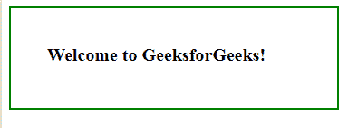

# jQuery |鼠标悬停()，示例

> 原文:[https://www . geesforgeks . org/jquery-mouse over-with-examples/](https://www.geeksforgeeks.org/jquery-mouseover-with-examples/)

mouseover()方法是 jQuery 中的一个内置方法，当鼠标指针在选定的元素上移动时，该方法会工作。

**语法:**

```
$(selector).mouseover(function)
```

**参数:**该方法接受单参数函数，可选。此参数用于指定调用 mouseover 事件时要运行的函数。

**返回值:**该方法返回有变化的选中元素。

下面的例子说明了 jQuery 中的 mouseover()方法:

**示例:**

```
<!DOCTYPE html>
<html>
    <head>
        <title>The mouseover Method</title>
        <script src=
        "https://ajax.googleapis.com/ajax/libs/jquery/3.3.1/jquery.min.js">
        </script>

        <!-- jQuery code to show the working of this method -->
        <script>
            $(document).ready(function() {
                $("p").mouseover(function() {
                    $("p").css("background-color", "lightgreen");
                });
            });
        </script>
        <style>
            body {
                width: 280px;
                padding: 40px;
                height: 30px;
                border: 2px solid green;
                font-weight: bold;
                font-size: 20px;
            }
        </style>
    </head>
    <body>

        <!-- move over this text to see the change -->
        <p>Welcome to GeeksforGeeks!</p>

    </body>
</html>
```

**输出:**
鼠标移过段落前:

鼠标移过段落后:


**相关文章:**

*   [jQuery | on()带示例](https://www.geeksforgeeks.org/jquery-on-with-examples/)
*   [jQuery | first()带示例](https://www.geeksforgeeks.org/jquery-first-with-examples/)
*   [jQuery | data()带示例](https://www.geeksforgeeks.org/jquery-data-with-examples/)