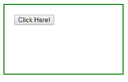
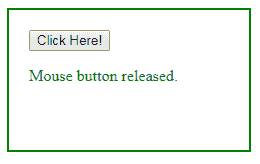
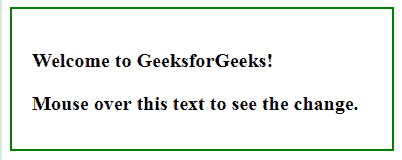
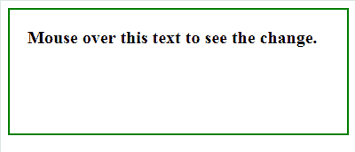

# jQuery | mouseup()带示例

> 原文:[https://www.geeksforgeeks.org/jquery-mouseup-with-examples/](https://www.geeksforgeeks.org/jquery-mouseup-with-examples/)

mouseup()方法是 jQuery 中的一个内置方法，当鼠标左键在选定的元素上释放时，该方法工作。

**语法:**

```
$(selector).mouseup(parameter)
```

**参数:**该方法接受单参数*功能*，可选。此参数用于指定调用 mouseup 事件时要运行的函数。

**返回值:**该方法在调用函数时返回带有变化的选定元素。

下面的例子说明了 jQuery 中的 mouseup()方法:

**例 1:** 本例包含参数。

```
<!DOCTYPE html>
<html>
    <head>
        <title>The mouseup Method</title>
        <script src=
        "https://ajax.googleapis.com/ajax/libs/jquery/3.3.1/jquery.min.js">
        </script>

        <!-- jQuery code to show the working of this method -->
        <script>
            $(document).ready(function() {
                $("button").mouseup(function() {
                    $("div").after(
                     "<p style='color:green;'>Mouse button released.</p>");
                });
            });
        </script>
        <style>
            body {
                width: 200px;
                padding: 20px;
                min-height: 100px;
                border: 2px solid green;
            }
        </style>
    </head>
    <body>
        <!-- click on this button and release -->
        <button>Click Here!</button>

    </body>
</html>
```

**输出:**
前点击按钮:
后点击按钮:


**程序 2:** 本例不包含参数。

```
<!DOCTYPE html>
<html>
    <head>
        <title>The mouseup Method</title>
        <script src=
        "https://ajax.googleapis.com/ajax/libs/jquery/3.3.1/jquery.min.js">
        </script>

        <!-- jQuery code to show the working of this method -->
        <script>
            $(document).ready(function() {
                $("div").mouseover(function() {
                    $("p").mouseup().slideToggle();
                });
            });
        </script>
        <style>
            body {
                width: 340px;
                padding: 20px;
                height: 100px;
                border: 2px solid green;
                font-weight: bold;
                font-size: 20px;
            }
        </style>
    </head>
    <body>

        <p>Welcome to GeeksforGeeks!</p>

        <!-- move over this text to see the change -->
        <div>Mouse over this text to see the change.</div>

    </body>
</html>
```

**输出:**
将鼠标移到 div 元素上之前:

将鼠标移到 div 元素上之后:


**相关文章:**

*   [jQuery | chaining()方法](https://www.geeksforgeeks.org/jquery-chaining/)
*   [jQuery | preventDefault()方法](https://www.geeksforgeeks.org/jquery-preventdefault-method/)
*   [jQuery | blur()带示例](https://www.geeksforgeeks.org/jquery-blur-with-examples/)