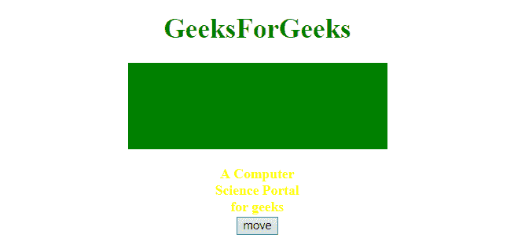
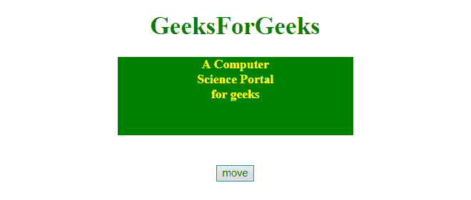

# jQuery |将一个元素移动到另一个元素中

> 原文:[https://www . geesforgeks . org/jquery-将一个元素移动到另一个元素中/](https://www.geeksforgeeks.org/jquery-move-an-element-into-another-element/)

下面列出了将一个元素移动到另一个元素内部的两种方法:

**方法 1:使用 [append()方法](https://www.geeksforgeeks.org/jquery-append-method/):**jQuery 中的这个 append()方法用于在所选元素的末尾插入一些内容。

**语法:**

```
$(selector).append( content, function(index, html) )
```

**参数:**该方法接受两个参数，如上所述，如下所述:

*   **内容:**必选参数，用于指定要插入到所选元素末尾的内容。内容的可能值是 HTML 元素、jQuery 对象和 DOM 元素。
*   **函数(index，html):** 为可选参数，用于指定将返回待插入内容的函数。
    *   **索引:**用于返回元素的索引位置。
    *   **html:** 用于返回选中元素的当前 html。

**示例:**

```
<!DOCTYPE html>  
<html>  

<head> 
    <title> 
        JavaScript
    </title>

    <script src=
"https://ajax.googleapis.com/ajax/libs/jquery/3.3.1/jquery.min.js">
    </script>

    <style>
        #parent {
            height: 100px;
            width: 300px;
            background: green;
            margin: 0 auto;
        }
        #child {
            height: 40px;
            width: 100px;
            margin: 0 auto;
            color: yellow
        }
    </style>
</head> 

<body style = "text-align:center;">  

    <h1 style = "color:green;" >  
        GeeksForGeeks  
    </h1>  

    <div id= "parent"></div>

    <br>

    <h4 id= "child">
        A Computer Science Portal for geeks
    </h4>

    <br>

    <button onclick="myGeeks()"> 
        move
    </button> 

    <!-- Script to move element -->        
    <script> 
        function myGeeks() {
            $("#parent").append($("#child"));
        }
    </script> 
</body>  

</html>
```

**输出:**

*   **点击按钮前:**
    
*   **点击按钮后:**
    

**方法 2:使用 [prepend()方法](https://www.geeksforgeeks.org/jquery-prepend-with-examples/):**prepend()方法是 jQuery 中的一个内置方法，用于在所选元素的开头插入指定的内容。

**语法:**

```
$(selector).prepend(content, function)
```

**参数:**该方法接受两个参数，如上所述，如下所述:

*   **内容:**是必输参数，用于指定需要插入的内容。
*   **功能:**是可选参数，用于指定调用后要执行的功能。

**示例:**

```
<!DOCTYPE html>  
<html>  

<head> 
    <title> 
        JavaScript
    </title>

    <script src=
"https://ajax.googleapis.com/ajax/libs/jquery/3.3.1/jquery.min.js">
    </script>

    <style>
        #parent {
            height: 100px;
            width: 300px;
            background: green;
            margin: 0 auto;
        }
        #child {
            height: 40px;
            width: 100px;
            margin: 0 auto;
            color: yellow
        }
    </style>
</head> 

<body style = "text-align:center;">  

    <h1 style = "color:green;" >  
        GeeksForGeeks  
    </h1>  

    <div id= "parent"></div>

    <br>

    <h4 id= "child">
        A Computer Science Portal for geeks
    </h4>

    <br>

    <button onclick="myGeeks()"> 
        move
    </button> 

    <!-- Script to move element -->    
    <script> 
         function myGeeks() {
            $("#parent").prepend($("#child"));
        }
    </script> 
</body>  

</html>
```

**输出:**

*   **点击按钮前:**
    
*   **点击按钮后:**
    