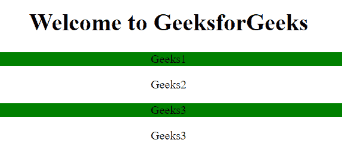

# jQuery |多类选择器

> 原文:[https://www . geesforgeks . org/jquery-多类-选择器/](https://www.geeksforgeeks.org/jquery-multiple-classes-selector/)

**。jquery 中的类选择器**用于选择多个类。

**语法:**

```html
$(".class1, .class2, .class3, ...")
```

**参数:**

*   **类别:**需要此参数来指定要选择的元素的类别。

**示例-1:**

```html
<!DOCTYPE html>
<html>

<head>
    <script src=
"https://ajax.googleapis.com/ajax/libs/jquery/3.3.1/jquery.min.js">
  </script>

  <script>
        $(document).ready(function() {
         $(".geeks, .for, .GeeksforGeeks").css(
              "background-color", "green");
        });
    </script>
</head>

<body>
    <center>
        <h1 class="geeks">
          Welcome to GeeksforGeeks
      </h1>

        <p>Geeks1</p>
        <p class="for">Geeks2</p>
        <p>Geeks3</p>
        <p class="GeeksforGeeks">
          Geeks3
      </p>
    </center>
</body>

</html>
```

**输出:**


**示例-2:**

```html
<!DOCTYPE html>
<html>

<head>
    <script src=
"https://ajax.googleapis.com/ajax/libs/jquery/3.3.1/jquery.min.js">
  </script>

  <script>
        $(document).ready(function() {
            $(".c1, .c2").css(
              "background-color", "green");
        });
    </script>
</head>

<body>
    <center>
        <h1 class="geeks">
          Welcome to GeeksforGeeks
      </h1>

        <p class="c1">Geeks1</p>
        <p class="for">Geeks2</p>
        <p class="c2">Geeks3</p>
        <p class=
           "GeeksforGeeks">
          Geeks3
      </p>
    </center>
</body>

</html>
```

**输出:**


**支持的浏览器:**

*   谷歌 Chrome 90.0+
*   Internet Explorer 9.0
*   Firefox 3.6
*   Safari 4.0
*   歌剧 10.5