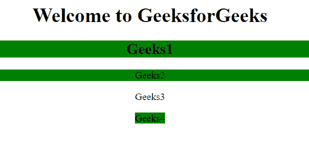
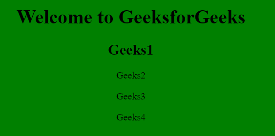

# jQuery |多元素选择器

> 原文:[https://www . geesforgeks . org/jquery-多元素-选择器/](https://www.geeksforgeeks.org/jquery-multiple-elements-selector/)

使用选择器选择**多个元素**有两种方式:

*   **元件**选择器
*   ***** 选择器

**语法:**

*   **元素选择器:**

    ```html
    $("element1, element2, element3, ...")
    ```

*   **用于*选择器:**

    ```html
    $("*")
    ```

**参数:**

*   **元素:**需要此参数来指定要选择的元素。

**示例-1:** 使用**元素**选择器。

```html
<!DOCTYPE html>
<html>

<head>
    <script src=
"https://ajax.googleapis.com/ajax/libs/jquery/3.3.1/jquery.min.js">
  </script>

  <script>
        $(document).ready(function() {
            $("h2, div, span").css(
              "background-color", "green");
        });
    </script>
</head>

<body>
    <center>
        <h1>Welcome to GeeksforGeeks
      </h1>
        <h2>Geeks1</h2>

        <div>Geeks2</div>

        <p>Geeks3</p>
        <p><span>Geeks4</span></p>
    </center>

</body>

</html>
```

**输出:**


**示例-2:** 使用 ***** 选择器。

```html
<!DOCTYPE html>
<html>

<head>
    <script src=
"https://ajax.googleapis.com/ajax/libs/jquery/3.3.1/jquery.min.js">
  </script>
    <script>
        $(document).ready(function() {
            $("*").css(
            "background-color", "green");
        });
    </script>
</head>

<body>
    <center>
        <h1>Welcome to GeeksforGeeks</h1>
        <h2>Geeks1</h2>

        <div>Geeks2</div>

        <p>Geeks3</p>
        <p><span>Geeks4</span></p>
    </center>

</body>

</html>
```

**输出:**


**支持的浏览器:**

*   谷歌 Chrome 90.0+
*   Internet Explorer 9.0
*   Firefox 3.6
*   Safari 4.0
*   歌剧 10.5