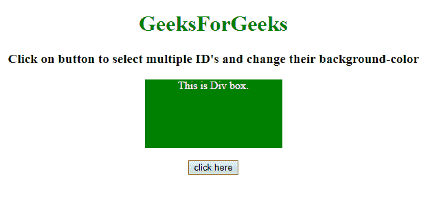
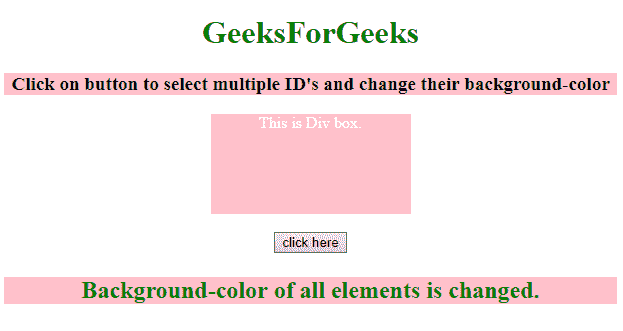
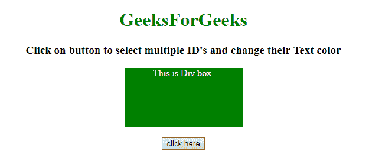
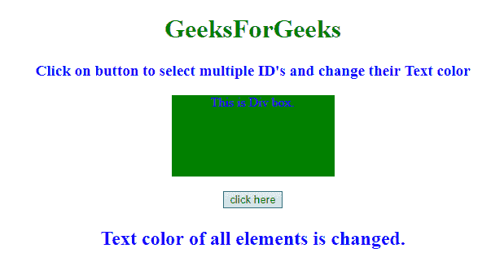

# JQuery |多个 ID 选择器

> 原文:[https://www.geeksforgeeks.org/jquery-multiple-id-selectors/](https://www.geeksforgeeks.org/jquery-multiple-id-selectors/)

给定一个 HTML 文档，任务是使用 JQuery 同时选择具有不同标识的元素。

**进场:**

*   选择不同元素的标识，然后使用每个()方法对所有选定的标识元素应用 CSS 属性。
*   然后使用 css()方法将所有选中元素的背景颜色设置为粉色。
*   显示指示多个标识选择器的文本。

**示例 1:** 在本示例中，选择不同 ID 的元素，并更改这些元素的背景颜色。

```html
<!DOCTYPE HTML> 
<html> 
    <head> 
        <title> 
            JQuery | Multiple ID selectors
        </title>

        <style>
            #GFG_DIV {
                background: green;
                height: 100px;
                width: 200px;
                margin: 0 auto;
                color: white;
            }
        </style>

        <script src =
"https://ajax.googleapis.com/ajax/libs/jquery/3.4.0/jquery.min.js">
        </script>
    </head> 

    <body style = "text-align:center;"> 

        <h1 style = "color:green;" > 
            GeeksForGeeks 
        </h1>

        <p id = "GFG_UP" style =
            "font-size: 19px; font-weight: bold;">
        </p>

        <div id = "GFG_DIV">
            This is Div box.
        </div>
        <br>

        <button onClick = "GFG_Fun()">
            click here
        </button>

        <p id = "GFG_DOWN" style =
            "color: green; font-size: 24px; font-weight: bold;">
        </p>

        <script>
            $('#GFG_UP').text("Click on button to select multiple"
                    + " ID's and change their background-color");

            function GFG_Fun() {
                $("#GFG_UP, #GFG_DIV, #GFG_DOWN").each(function(){
                    $(this).css("background-color", "pink");
                });

                $('#GFG_DOWN').text("Background-color of all "
                        + "elements is changed."); 
            }
        </script> 
    </body> 
</html>                    
```

**输出:**

*   **点击按钮前:**
    
*   **点击按钮后:**
    

**示例 2:** 在本示例中，选择不同 ID 的元素，并更改这些元素的文本颜色。

```html
<!DOCTYPE HTML> 
<html> 
    <head> 
        <title> 
            JQuery | Multiple ID selectors
        </title>

        <style>
            #GFG_DIV {
                background: green;
                height: 100px;
                width: 200px;
                margin: 0 auto;
                color: white;
            }
        </style>

        <script src =
"https://ajax.googleapis.com/ajax/libs/jquery/3.4.0/jquery.min.js">
        </script>
    </head> 

    <body style = "text-align:center;"> 

        <h1 style = "color:green;" > 
            GeeksForGeeks 
        </h1>

        <p id = "GFG_UP" style =
            "font-size: 19px; font-weight: bold;">
        </p>

        <div id = "GFG_DIV">
            This is Div box.
        </div>
        <br>

        <button onClick = "GFG_Fun()">
            click here
        </button>

        <p id = "GFG_DOWN" style =
            "color: green; font-size: 24px; font-weight: bold;">
        </p>

        <script>
            $('#GFG_UP').text("Click on button to select multiple"
                    + "ID's and change their Text color");

        function GFG_Fun() {
            $("#GFG_UP, #GFG_DIV, #GFG_DOWN").each(function(){
                $(this).css("color", "blue");
            });

            $('#GFG_DOWN').text("Text color of all elements is "
                    + "changed."); 
        }
        </script> 
    </body> 
</html>                    
```

**输出:**

*   **点击按钮前:**
    
*   **点击按钮后:**
    

jQuery 是一个开源的 JavaScript 库，它简化了 HTML/CSS 文档之间的交互，它以其“少写多做”的理念而闻名。
跟随本 [jQuery 教程](https://www.geeksforgeeks.org/jquery-tutorials/)和 [jQuery 示例](https://www.geeksforgeeks.org/jquery-examples/)可以从头开始学习 jQuery。