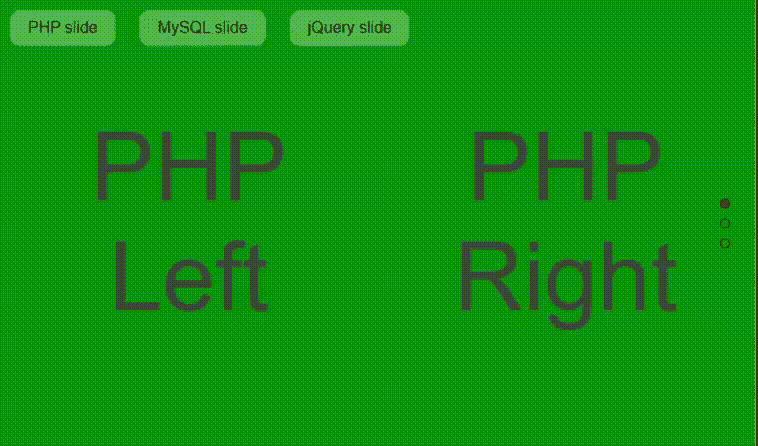
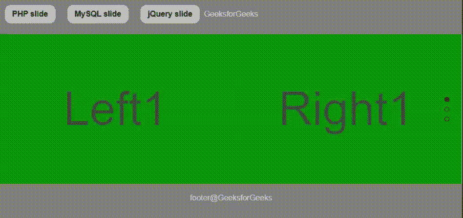

# jquery | multi croll 插件

> 原文:[https://www.geeksforgeeks.org/jquery-multiscroll-plugin/](https://www.geeksforgeeks.org/jquery-multiscroll-plugin/)

jQuery 提供了 **multiscroll.js** 插件，帮助程序员创建分割的网页以及分割的多个垂直滚动面板。

**注意:**请将 jQuery [多克隆插件](https://github.com/alvarotrigo/multiscroll.js)下载到你的工作文件夹中，并在你的代码头部分包含所需的文件，如下所示。下载[jquery . easings . min . js](https://github.com/alvarotrigo/multiscroll.js/tree/master/vendors)文件。下载[【示例. CSS】](https://github.com/alvarotrigo/multiscroll.js/tree/master/examples)

**包含 jQuery multiscroll.js Plugin 文件:**

> <link href="”jquery.multiscroll.css”" rel="”stylesheet”" type="”text/css”/">
> <link href = " examples . CSS " rel = "样式表" type = " text/CSS "/>
> <script src = " http://Ajax . googleapis . com/Ajax/libs/jquery/1 . 8 . 3/jquery . min . js "></script>
> T11】script src = " jquery . easings . min . js "></script>

**示例 1:** 在下面的示例中，演示了**多滚动插件**，其导致页面的分割垂直滚动。一些基本的选项设置是在多克隆插件的 jQuery 功能中完成的，比如循环效果的*循环底部:真*、*循环顶部:真*。其他选项如*滚动速度:1000* 用于管理速度参数。程序员可以根据应用程序的要求设置选项。

```html
<!DOCTYPE html>
<html xmlns="https://www.w3.org/1999/xhtml">

<head>
    <meta http-equiv="Content-Type" 
          content="text/html; charset = utf-8" />
    <title> jQuery Multiscroll Plugin</title>

    <link rel="stylesheet" type="text/css" 
          href="jquery.multiscroll.css" />
    <link rel="stylesheet" type="text/css" href="examples.css" />

    <script src=
"https://ajax.googleapis.com/ajax/libs/jquery/1.8.3/jquery.min.js">
  </script>
    <script type="text/javascript" src="jquery.easings.min.js">
    </script>
    <script type="text/javascript" src="jquery.multiscroll.js">
    </script>
    <script type="text/javascript">
        $(document).ready(function() {
            $('#containerDivID').multiscroll({
                sectionsColor: ['#008000', '#32CD32', '#90EE90'],
                anchors: ['php', 'mysql', 'jquery'],
                menu: '#menu',
                navigation: true,
                navigationTooltips: ['php', 'mysql', 'jquery'],
                loopBottom: true,
                loopTop: true,
                leftSelector: 'ms-left',
                rightSelector: 'ms-right',
                scrollingSpeed: 1000
            });
        });
    </script>
</head>

<body>
    <ul id="menu">
        <li data-menuanchor="first">
          <a href="#php">PHP slide</a></li>
        <li data-menuanchor="second">
          <a href="#mysql">MySQL slide</a></li>
        <li data-menuanchor="third">
          <a href="#jquery">jQuery slide</a></li>
    </ul>

    <div id="containerDivID">
        <div class="ms-left">
            <div class="ms-section" id="phpleftId">
                <h1>PHP Left </h1>
            </div>

            <div class="ms-section" id="mysqlleftId">
                <h1>MySQL Left </h1>
            </div>

            <div class="ms-section" id="jqueryleftId">
                <h1>jQuery Left </h1>
            </div>

        </div>

        <div class="ms-right">
            <div class="ms-section" id="phprightId">
                <h1>PHP Right </h1>
            </div>

            <div class="ms-section" id="mysqlrightId">
                <h1>MySQL Right </h1>
            </div>

            <div class="ms-section" id="jqueryrightId">
                <h1>jQuery Right</h1>
            </div>
        </div>
    </div>
</body>

</html>
```

**输出:**


**示例 2:** 在下面的示例中，**多滚动插件**演示了一些更多的选项设置，如*放松:*。在代码的 CSS 部分中也设计了页眉和页脚部分，并在 jQuery 代码中实现了填充选项设置。

```html
<!DOCTYPE html>
<html xmlns="https://www.w3.org/1999/xhtml">

<head>
    <meta http-equiv="Content-Type" 
          content="text/html; charset = utf-8" />
    <title> jQuery Multiscroll Plugin</title>

    <link rel="stylesheet" type="text/css" 
          href="jquery.multiscroll.css" />
    <link rel="stylesheet" type="text/css"
          href="examples.css" />
    <script src=
"https://ajax.googleapis.com/ajax/libs/jquery/1.8.3/jquery.min.js">
  </script>
    <script type="text/javascript" src="jquery.easings.min.js">
    </script>
    <script type="text/javascript" src="jquery.multiscroll.js">
    </script>

    <script type="text/javascript">
        $(document).ready(function() {
            $('#containerDivID').multiscroll({
                sectionsColor: ['#008000', '#32CD32', '#90EE90'],
                anchors: ['php', 'mysql', 'jquery'],
                menu: '#menu',
                css3: true,
                navigation: true,
                navigationTooltips: ['php', 'mysql', 'jquery'],
                easing: 'easeOutBack',
                paddingTop: '100px',
                paddingBottom: '100px'
            });
        });
    </script>

    <style>
        #headerDivID,
        #footerDivID {
            position: fixed;
            width: 100%;
            height: 50px;
            display: block;
            text-align: center;
            background: #808080;
            z-index: 5;
            color: #e9e9e9;
            padding: 20px 0 0 0;
        }

        #headerDivID {
            top: 0px;
        }

        #footerDivID {
            bottom: 0px;
        }

        #menu {
            position: fixed;
            height: 50px;
            z-index: 50;
            width: 100%;
            padding: 0;
            margin: 0;
        }

        #menu li {
            display: inline-block;
            margin: 10px;
            color: #0000;
            background-color: #808080;
            background: rgba(255, 255, 255, 0.5);
            -webkit-border-radius: 12px;
        }

        #menu li a {
            text-decoration: none;
            color: #000;
        }

        #menu li.active {
            background-color: #696969;
            background: rgba(255, 255, 255, 1.5);
            color: #0000;
        }

        #menu li:hover {
            background: rgba(255, 255, 255, 0.5);
        }

        #menu li.active a {
            color: #0000;
        }

        #menu li.active a:hover {
            color: #0000;
        }

        #menu li a,
        #menu li.active a {
            padding: 10px 15px;
            display: block;
        }
    </style>
</head>

<body>
    <div id="headerDivID">GeeksforGeeks</div>
    <div id="footerDivID">footer@GeeksforGeeks</div>
    <ul id="menu">
        <li data-menuanchor="first"><a href="#php">
          <b>PHP slide</b></a></li>
        <li data-menuanchor="second"><a href="#mysql">
          <b>MySQL slide</b></a></li>
        <li data-menuanchor="third"><a href="#jquery">
          <b>jQuery slide</b></a></li>
    </ul>

    <div id="containerDivID">
        <div class="ms-left">
            <div class="ms-section" id="phpleftId">
                <h1>Left1 </h1>
            </div>

            <div class="ms-section" id="mysqlleftId">
                <h1> Left2 </h1>
            </div>

            <div class="ms-section" id="jqueryleftId">
                <h1> Left3 </h1>
            </div>
        </div>

        <div class="ms-right">
            <div class="ms-section" id="phprightId">
                <h1>Right1 </h1>
            </div>

            <div class="ms-section" id="mysqlrightId">
                <h1>MySQL Right2 </h1>
            </div>

            <div class="ms-section" id="jqueryrightId">
                <h1>jQuery Right3</h1>
            </div>
        </div>
    </div>
</body>

</html>
```

**输出:**
