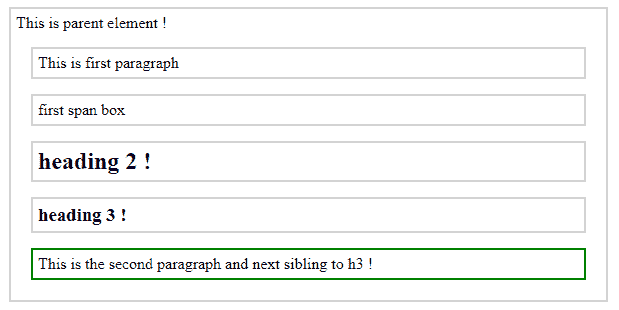
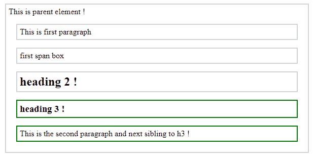

# jQuery | next() & nextAll()带示例

> 原文:[https://www . geesforgeks . org/jquery-next-next all-with-examples/](https://www.geeksforgeeks.org/jquery-next-nextall-with-examples/)

**下一个()**

**next()** 是 jQuery 中的一个内置函数，用于返回所选元素的下一个同级。兄弟是那些在 DOM 树中有相同父元素的元素。文档对象模型是一个万维网联盟标准。这定义了访问 DOM 树中的元素。
**语法:**

```
$(selector).next()

```

**参数:**不接受任何参数。
**返回值:**返回所选元素的下一个兄弟。

<center>**jQuery code to show the working of next() method:**</center>

**Code #1:**

```
<html>

<head>
    <style>
        .next * {
            display: block;
            border: 2px solid lightgrey;
            color: black;
            padding: 5px;
            margin: 15px;
        }
    </style>
    <script src="https://ajax.googleapis.com/ajax/libs/
                  jquery/3.3.1/jquery.min.js"></script>
    <script>
        $(document).ready(function() {
            $("h3").next().css({
                "color": "black",
                "border": "2px solid green"
            });
        });
    </script>
</head>

<body class="next">
    <div>
        This is parent element !
        <p>This is first paragraph </p>
        <span>first span box </span>
        <h2>heading 2 !</h2>
        <h3>heading 3 !</h3>
        <p>This is the second paragraph and next
           sibling to h3 !</p>
    </div>
</body>

</html>
```

在上面的代码中，“h3”的下一个兄弟元素用绿色突出显示。
**输出:**


**下一页全部（）**

**nextAll()** 是 jQuery 中的一个内置方法，用于返回所选元素的所有下一个兄弟元素。
**语法:**

```
$(selector).nextAll()

```

**参数:**不接受任何参数。
**返回值:**返回所选元素的所有下一个兄弟元素。

<center>**jQuery code to show the working of nextAll() method:**</center>

**Code #2:**

```
<!DOCTYPE html>
<html>

<head>
    <style>
        .next * {
            display: block;
            border: 2px solid lightgrey;
            color: black;
            padding: 5px;
            margin: 15px;
        }
    </style>
    <script src="https://ajax.googleapis.com/ajax/libs/
                  jquery/3.3.1/jquery.min.js"></script>
    <script>
        $(document).ready(function() {
            $("h2").nextAll().css({
                "color": "black",
                "border": "2px solid green"
            });
        });
    </script>
</head>

<body class="next">
    <div>
        This is parent element !
        <p>This is first paragraph </p>
        <span>first span box </span>
        <h2>heading 2 !</h2>
        <h3>heading 3 !</h3>
        <p>This is the second paragraph and next
             sibling to h3 !</p>
    </div>
</body>

</html>
```

在上面的代码中，“h2”的所有下一个兄弟元素都用绿色突出显示。
**输出:**
