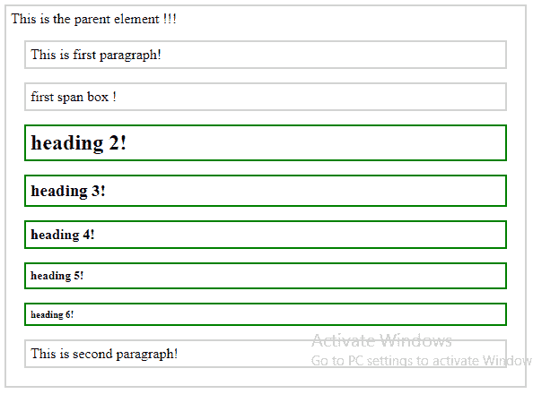
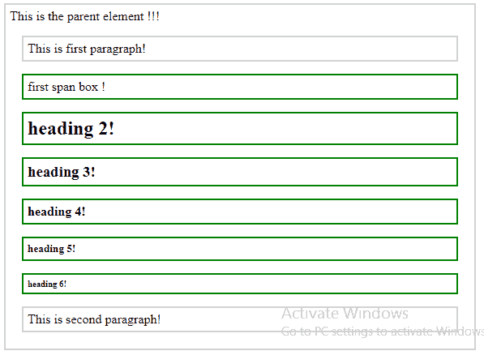

# jQuery | next 直到()带示例

> 原文:[https://www . geeksforgeeks . org/jquery-next 直到-with-examples/](https://www.geeksforgeeks.org/jquery-nextuntil-with-examples/)

**next 直到()**是 jQuery 中的一个内置方法，用于**查找两个给定元素**之间的所有兄弟元素。兄弟是那些在 DOM 树中有相同父元素的元素。文档对象模型是一个万维网联盟标准。这定义了访问 DOM 树中的元素。
**语法:**

```
$(selector1).nextUntil(selector2)

```

这里 selector1 是开始元素，之后将会发现兄弟。
**参数:**它接受一个参数“selector2”，这是最后一个找到兄弟的元素。
**返回值:**返回“选择符 1”和“选择符 2”之间的所有兄弟。

<center>**jQuery code to show the working of nextUntil() method:**</center>

**Code #1:**

```
<html>

<head>
    <style>
        .bet_sib * {
            display: block;
            border: 2px solid lightgrey;
            color: black;
            padding: 5px;
            margin: 15px;
        }
    </style>
    <script src="https://ajax.googleapis.com/ajax/libs/
                jquery/3.3.1/jquery.min.js"></script>
    <script>
        $(document).ready(function() {
            $("span").nextUntil("p").css({
                "color": "black",
                "border": "2px solid green"
            });
        });
    </script>
</head>

<body class="bet_sib">
    <div>
        This is the parent element !!!
        <p>This is first paragraph!</p>
        <span>first span box !</span>
        <h2>heading 2!</h2>
        <h3>heading 3!</h3>
        <h4>heading 4!</h4>
        <h5>heading 5!</h5>
        <h6>heading 6!</h6>
        <p>This is second paragraph!</p>
    </div>
</body>

</html>
```

在上面的代码中，“span”和下一个“p”之间的所有元素(或兄弟)都被高亮显示。
**输出:**


**代码#2:**
在下面的代码中，可以选择同一对元素之间的所有兄弟。

```
<html>

<head>
    <style>
        .bet_sib * {
            display: block;
            border: 2px solid lightgrey;
            color: black;
            padding: 5px;
            margin: 15px;
        }
    </style>
    <script src="https://ajax.googleapis.com/ajax/libs/
                 jquery/3.3.1/jquery.min.js"></script>
    <script>
        $(document).ready(function() {
            $("p").nextUntil("p").css({
                "color": "black",
                "border": "2px solid green"
            });
        });
    </script>
</head>

<body class="bet_sib">
    <div>
        This is the parent element !!!
        <p>This is first paragraph!</p>
        <span>first span box !</span>
        <h2>heading 2!</h2>
        <h3>heading 3!</h3>
        <h4>heading 4!</h4>
        <h5>heading 5!</h5>
        <h6>heading 6!</h6>
        <p>This is second paragraph!</p>
    </div>
</body>

</html>
```

在上面的代码中，段落元素之间的所有元素(或兄弟元素)都用绿色突出显示。
**输出:**
