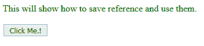

# jQuery | noConflict()带示例

> 原文:[https://www . geeksforgeeks . org/jquery-noconflict-with-examples/](https://www.geeksforgeeks.org/jquery-noconflict-with-examples/)

**noConflict()** 是 jQuery 中的内置函数，jQuery 一般使用“{ content }”x201；作为快捷方式标识符签名。有很多 javascript 库，比如 Angular Js、Ember、淘汰赛等等。现在如果其他带有 jQuery 的 JavaScript 框架开始使用“{content}”的话，签字作为捷径，那么就会有冲突，其中一个框架可能会停止工作。因此，实现了 noConflict 方法。

**语法:**

```html
$.noConflict();
```

**参数:**不接受任何参数。
**返回值:**不返回任何东西。
**冲突是如何产生的？**
**例:**

```html
src="prototype.js"
src="jquery.js"
```

在上面的例子中，有两个 JavaScript 库在同一个文件中使用，并且它们都使用相同的“{content}”。签名选择元素。现在冲突出现了，可能其中一个库无法使用“{content}”访问元素。签名。
noConflict()方法释放对“{content}”的保留；快捷方式标识符，以便其他脚本可以使用它。
**产生冲突的 jQuery 代码:**

```html
<html>

<head>
    <script src="https://ajax.googleapis.com/ajax/libs/
                  jquery/3.3.1/jquery.min.js"></script>
    <script>
        jq(document).ready(function() {
            jq("button").click(function() {
                jq("p").text("jQuery is still working!");
            });
        });
    </script>
</head>

<body>
    <p style="color:green">This will show how to save
                           reference and use them.</p>
    <button>Click Me.!</button>
</body>

</html>
```

**输出:**
点击按钮前-

点击按钮后-

此处输出与点击按钮前后相同，因此存在冲突。
**jQuery 代码使用 noConflict()函数克服这样的冲突:**

```html
<html>

<head>
    <script src="https://ajax.googleapis.com/ajax/libs/jquery/3.3.1/jquery.min.js"></script>
    <script>
        //Here noConflict() reference is saved to a variable
        var jq = $.noConflict();
        jq(document).ready(function() {
            jq("button").click(function() {
                jq("p").text("jQuery is still working!");
            });
        });
    </script>
</head>

<body>
    <p style="color:green">This will show how to save 
                           reference and use them.</p>
    <button>Click Me.!</button>
</body>

</html>
```

**输出:**
点击按钮前-

点击按钮后-
