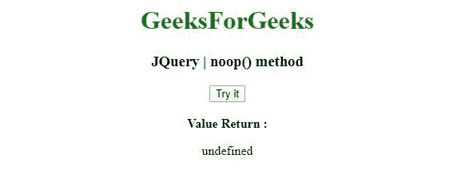
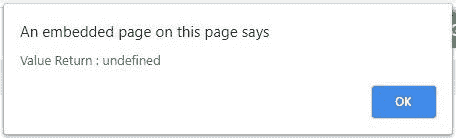

# JQuery | noop()方法

> 原文:[https://www.geeksforgeeks.org/jquery-noop-method/](https://www.geeksforgeeks.org/jquery-noop-method/)

jQuery 中的这个 **noop()** 方法是当用户希望传递一个什么都不做的函数时的空函数。

**语法:**

```html
jQuery.noop()

```

**参数:**noop()方法不接受任何参数。

**返回值:**返回未定义。

**示例 1:** 在本例中， **noop()方法**与 **innerHTML** 功能一起使用。

```html
<!DOCTYPE html>
<html>
<head>
<meta charset="utf-8">
<title>JQuery | noop() method</title> 
<script src="https://code.jquery.com/jquery-3.4.1.js"></script>

</head>
<body style="text-align:center;"> 

    <h1 style="color: green"> 
        GeeksForGeeks 
    </h1> 

    <h3>JQuery | noop() method</h3>
    <button onclick="geek()">Try it</button>
    <br><br>
    <b> Value Return :</b>
    <br>
    <p id="demo"></p>

    <script>
    function geek() {
      var n = jQuery.noop();
      document.getElementById("demo").innerHTML = n;
    }
    </script>
</body>
</html>                                                                                            
```

**输出:**
**点击前:**

**点击后:**


**例 2:** 在本例中， **noop()方法**与**报警**功能一起使用。

```html
<!DOCTYPE html>
<html>
<head>
<meta charset="utf-8">
<title>JQuery | noop() method</title> 
<script src="https://code.jquery.com/jquery-3.4.1.js"></script>

</head>
<body style="text-align:center;"> 

    <h1 style="color: green"> 
        GeeksForGeeks 
    </h1> 

    <h3>JQuery | noop() method</h3>
    <button onclick="geek()">Try it</button>

    <script>
    function geek() {
      var n = jQuery.noop();
      alert("Value Return : " + n);
    }
    </script>
</body>
</html>                                        
```

**输出:**
**点击前:**

**点击后:**
