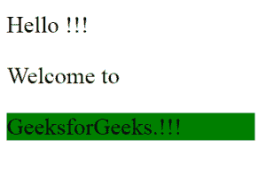
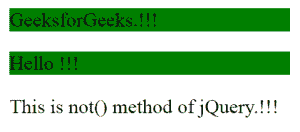

# jQuery | not()方法示例

> 原文:[https://www . geeksforgeeks . org/jquery-不带示例的方法/](https://www.geeksforgeeks.org/jquery-not-method-with-examples/)

**not()** 是 jQuery 中的一个内置函数，与 [filter()](https://www.geeksforgeeks.org/jquery-filter/) 方法正好相反。此函数将返回所有与具有特定“id”或“class”的选定元素不匹配的元素。
**语法:**

```
$(selector).not(A)

```

选择器是不被选择的被选元素。
**参数:**它接受一个参数“A”，这个参数或者是指定元素的“id”或者是“class”。
**返回值:**这将返回除所选元素之外的所有元素。
<none>**JavaScript 代码展示了这个函数的工作原理:**</none>
**代码#1:**
在下面的代码中除了用类“main”以外的所有段落元素都在背景中用绿色突出显示。

```
<html>

<head>
  <script src="https://ajax.googleapis.com/ajax/libs/
            jquery/3.3.1/jquery.min.js"></script>
  <script>
    $(document).ready(function() {
        $("p").not(".main").css("background-color", "green");
    });
  </script>
</head>

<body>
    <p class="main">Hello !!!</p>
    <p class="main">Welcome to</p>
    <p>GeeksforGeeks.!!!</p>
</body>

</html>
```

**输出:**

**代码#2:**
在下面所有 id 为“main”的段落元素在背景中用绿色突出显示。

```
<html>

<head>
  <script src="https://ajax.googleapis.com/ajax/libs/
          jquery/3.3.1/jquery.min.js"></script>
  <script>
    $(document).ready(function() {
      $("p").filter("#main").css("background-color", "green");
     });
  </script>
</head>

<body>
    <p id="main">GeeksforGeeks.!!!</p>
    <p id="main">Hello !!!</p>
    <p>This is not() method of jQuery.!!!</p>
</body>

</html>
```

**输出:**
