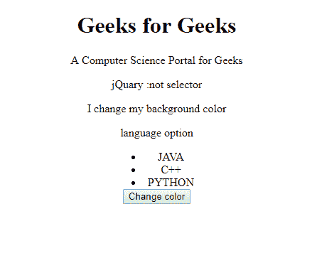
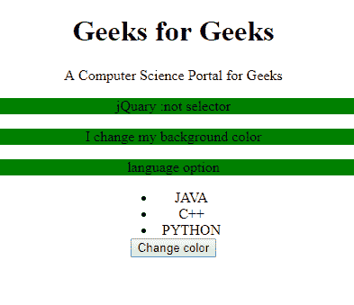

# jQuery | :not()选择器

> 原文:[https://www.geeksforgeeks.org/jquery-not-selector/](https://www.geeksforgeeks.org/jquery-not-selector/)

**:not()选择器**用于选择所有未被选择的元素。

**语法**

```html
$(":not(selector)")
```

**参数:**

*   **选择器:**用于指定不被选择的元素。选择器参数接受任何类型的选择器。

**示例:**更改 **p** 元素的背景色。

```html
<!DOCTYPE html>
<html>

<head>
    <script src=
"https://ajax.googleapis.com/ajax/libs/jquery/3.3.1/jquery.min.js">
    </script>
    <script>
        $(document).click(function() {
            $("p:not(.intro)").css(
              "background-color", "green");
        });
    </script>
</head>

<body>
    <center>
        <h1>Geeks for Geeks</h1>

        <p class="intro">
          A Computer Science Portal for Geeks
      </p>
        <p>jQuary :not selector
      </p>
        <p>I change my background color
      </p>

        <p>language option</p>

        <ul id="choose"
            style="width:5em; 
                   margin:0 auto;">
            <li>
              JAVA
          </li>
            <li>
              C++
          </li>
            <li>
              PYTHON
          </li>
        </ul>

        <button>
          Change color
      </button>
    </center>
</body>

</html>
```

**输出:**
**前:**


**之后:**
