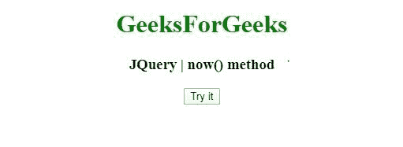
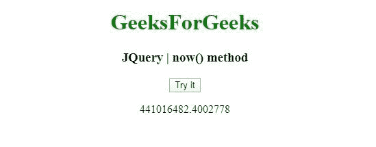
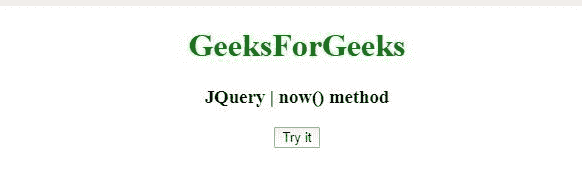
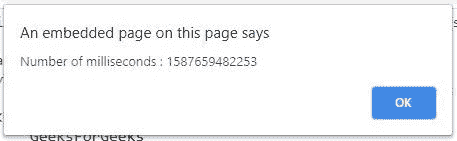

# JQuery | now()方法

> 原文:[https://www.geeksforgeeks.org/jquery-now-method/](https://www.geeksforgeeks.org/jquery-now-method/)

jQuery 中的这个 **now()** 方法用来返回一个代表当前时间的数字。

**语法:**

```
jQuery.now()

```

**参数:**now()方法不接受任何参数。

**返回值:**返回代表当前时间的数字。

**例 1:** 在本例中， **now()方法** a 用 **innerHTML** 功能显示毫秒数。

```
<!DOCTYPE html>
<html>
<head>
<meta charset="utf-8">
<title>JQuery | now() method</title> 
<script src="https://code.jquery.com/jquery-3.4.1.js"></script>

</head>
<body style="text-align:center;"> 

    <h1 style="color: green"> 
        GeeksForGeeks 
    </h1> 

    <h3>JQuery | now() method</h3>
    <button onclick="geek()">Try it</button>

    <p id="demo"></p>

    <script>
    function geek() {
      var n = jQuery.now();
      document.getElementById("demo").innerHTML = n/3600;
    }
    </script>
</body>
</html>                                                                                            
```

**输出:**
**点击前:**

**点击后:**


**例 2:** 在本例中， **now()方法** a 用**提醒**功能显示毫秒数。

```
<!DOCTYPE html>
<html>
<head>
<meta charset="utf-8">
<title>JQuery | now() method</title> 
<script src="https://code.jquery.com/jquery-3.4.1.js"></script>

</head>
<body style="text-align:center;"> 

    <h1 style="color: green"> 
        GeeksForGeeks 
    </h1> 

    <h3>JQuery | now() method</h3>
    <button onclick="geek()">Try it</button>

    <script>
    function geek() {
      var n = jQuery.now();
      alert("Number of milliseconds : " + n);
    }
    </script>
</body>
</html>                                        
```

**输出:**
**点击前:**

**点击后:**
