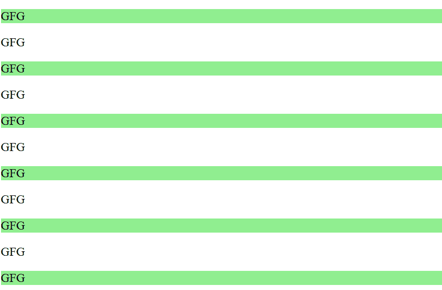

# jQuery |:第 n 个子()选择器

> 原文:[https://www.geeksforgeeks.org/jquery-nth-child-selector/](https://www.geeksforgeeks.org/jquery-nth-child-selector/)

**jQuery:第 n 个子()选择器**选择作为其父元素的**第 n 个子**的所有元素。

**语法:**

```html
$("Element:nth-child(Index/even/odd/equation)")
```

**Values:**

*   **索引:**提供的索引。索引从*   **偶数:**偶数个子元素被选中。*   **奇数:**奇数个子元素将被选中。*   **equation:** select child elements by solving a formula(an+b).

    **示例:**

    ```html
    <!DOCTYPE html>
    <html>

    <head>
        <script src=
    "https://ajax.googleapis.com/ajax/libs/jquery/3.3.1/jquery.min.js">
      </script>

        <script>
          $(document).ready(function() {
             $("p:nth-child(2n-1)").css("background-color", 
                                        "lightgreen");
            });
        </script>
    </head>

    <body>

        <p>GFG</p>
        <p>GFG</p>
        <p>GFG</p>
        <p>GFG</p>
        <p>GFG</p>
        <p>GFG</p>
        <p>GFG</p>
        <p>GFG</p>
        <p>GFG</p>
        <p>GFG</p>
        <p>GFG</p>

    </body>

    </html>
    ```

    **输出:**
    