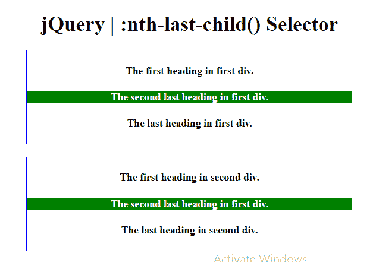
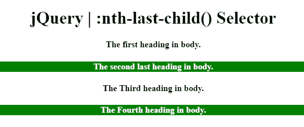

# jQuery |:第 n 个末子()选择器

> 原文:[https://www . geesforgeks . org/jquery-n th-last-child-selector/](https://www.geeksforgeeks.org/jquery-nth-last-child-selector/)

**:第 n 个最后一个子元素()选择器**用于选择其父元素的第 n 个<sup>最后一个子元素</sup>。元素的计数从最后一个元素开始。

**语法:**

```html
:nth-last-child(n|even|odd|formula)
```

**参数:**第 n 个最后一个子()选择器包含下列参数:

*   **n:** 保存所选元素的子索引号。计数从结束开始。第一个孩子的索引号是 1。
*   **偶数:**选择所有偶数子元素。
*   **奇数:**选择所有奇数子元素。
*   **公式:**用于指定选择子元素的公式。公式可以是(an + b)的形式。

下面的例子说明了 jQuery 中的:第 n 个-last-child()选择器:

**示例 1:** 本示例将父标题(div 标签)的倒数第二个标题的背景颜色更改为绿色，文本颜色更改为白色。

```html
<!DOCTYPE html>  
<html>  
    <head> 
        <title> 
            jQuery | :nth-last-child() Selector
        </title>

        <script src=
"https://ajax.googleapis.com/ajax/libs/jquery/3.3.1/jquery.min.js">
        </script>

        <!-- Script to use nth-last-child selector -->
        <script>
            $(document).ready(function() {
                $("h4:nth-last-child(2)").css({
                    "background-color": "green", 
                    "color": "white"
                });
            });
        </script>

        <style>
            option {
                font-weight: bold;
                font-size: 25px;
                color: green;
            }
            select {
                font-weight: bold;
                font-size: 25px;
                color: green;
            }
        </style>
    </head>

    <body style="text-align:center;">  
        <h1>  
            jQuery | :nth-last-child() Selector
        </h1> 

        <div style= "border: 1px solid blue;">
            <h4>The first heading in first div.</h4>
            <h4>The second last heading in first div.</h4>
            <h4>The last heading in first div.</h4>
        </div><br>

        <div style= "border: 1px solid blue;">
            <h4>The first heading in second div.</h4>
            <h4>The second last heading in first div.</h4>
            <h4>The last heading in second div.</h4>
        </div>           
    </body>  
</html>       
```

**输出:**


**示例 2:** 本示例将<正文>标签的倒数第二个标题的背景颜色更改为绿色，文本颜色更改为白色。

```html
<!DOCTYPE html>  
<html>  
    <head> 
        <title> 
            jQuery | :nth-last-child() Selector
        </title>

        <script src=
"https://ajax.googleapis.com/ajax/libs/jquery/3.3.1/jquery.min.js">
        </script>

        <!-- Script to use nth-last-child selector to 
                select nth last odd elements -->
        <script>
            $(document).ready(function() {
                $("h4:nth-last-child(odd)").css({
                    "background-color": "green", 
                    "color": "white"
                });
            });
        </script>

        <style>
            option {
                font-weight: bold;
                font-size: 25px;
                color: green;
            }
            select {
                font-weight: bold;
                font-size: 25px;
                color: green;
            }
        </style>
    </head> 

    <body style="text-align:center;">  
        <h1>  
            jQuery | :nth-last-child() Selector
        </h1> 

        <div>
            <h4>The first heading in body.</h4>
            <h4>The second last heading in body.</h4>
            <h4>The Third heading in body.</h4>
            <h4>The Fourth heading in body.</h4>
        </div>
    </body>  
</html>   
```

**输出:**
