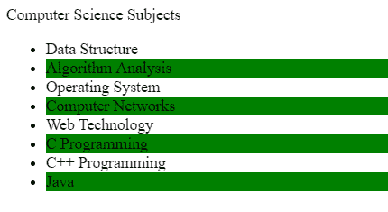
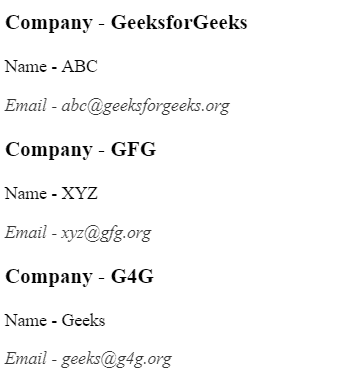

# jQuery |:第 n 个末位类型()选择器

> 原文:[https://www . geesforgeks . org/jquery-n-最后一个类型选择器/](https://www.geeksforgeeks.org/jquery-nth-last-of-type-selector/)

**:第 n 个最后一个类型()选择器**用于选择具有相同元素名称的父元素的所有子元素，从最后一个到第一个计数。它使用 1 索引计数。

**语法:**

```html
element:nth-last-of-type(n|even|odd|formula)
```

**参数:**

*   **n:** 它从最后选择第 n 个元素。
*   **偶数:**它从最后一个开始选择每个偶数元素。
*   **奇数:**它从最后选择每一个奇数元素。
*   **公式:**保存生成元素分组的公式，从最后开始，例如:3n+2 取 n-0，1，2，…的值，选择该表达式输出的每个元素

**示例 1:** 本示例使用:第 n 个最后一个类型()选择器从最后一个中选择奇数元素。

```html
<!DOCTYPE html>
<html>

<head>
    <title>
        jQuery | :nth-last-of-type() Selector
    </title>

    <script src=
"https://ajax.googleapis.com/ajax/libs/jquery/3.3.1/jquery.min.js">
    </script>
</head>

<body>
    Computer Science Subjects
    <ul>
        <li>Data Structure</li>
        <li>Algorithm Analysis</li>
        <li>Operating System</li>
        <li>Computer Networks</li>
        <li>Web Technology</li>
        <li>C Programming</li>
        <li>C++ Programming</li>
        <li>Java</li>
    </ul>

    <!-- Script to use :nth-last-of-type() Selector -->
    <script>
        $(document).ready(function() {
            var el = $("ul li:nth-last-of-type(odd)").css({
                background: "green"
            });
        });
    </script>
</body>

</html>                    
```

**输出**


**示例 2:** 本示例使用:第 n 个最后一个类型()选择器选择最后一个元素。

```html
<!DOCTYPE html>
<html>

<head>
    <title>
        jQuery | :nth-last-of-type() Selector
    </title>

    <script src=
"https://ajax.googleapis.com/ajax/libs/jquery/3.3.1/jquery.min.js">
    </script>
</head>

<body>
    <section>
        <article>
            <p>Company - GeeksforGeeks</p>
            <p>Name - ABC</p>
            <p>Email - abc@geeksforgeeks.org</p>
        </article>
        <article>
                <p>Company - GFG</p>
                <p>Name - XYZ</p>
                <p>Email - xyz@gfg.org</p>
        </article>
        <article>
                <p>Company - G4G</p>
                <p>Name - Geeks</p>
                <p>Email - geeks@g4g.org</p>
        </article>
    </section>

    <!-- Script to use :nth-last-of-type() selector -->
    <script>
        $(document).ready(function() {
            $("article p:first-of-type").css({
                fontWeight:"bold",
                fontSize:'1.2rem'
            })
            $("article p:nth-last-of-type(1)").css({
                fontStyle:'italic',
                opacity:0.8
            })
        })
    </script>
<body>

</html>                    
```

**输出:**
