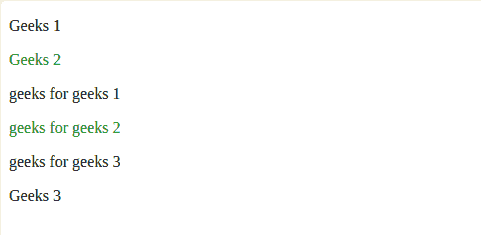
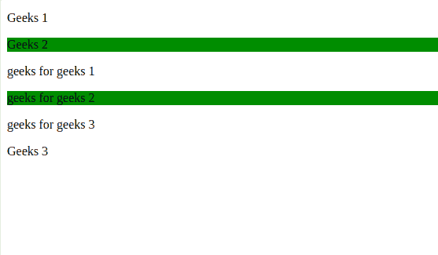
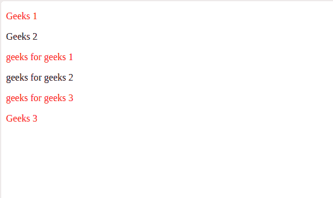
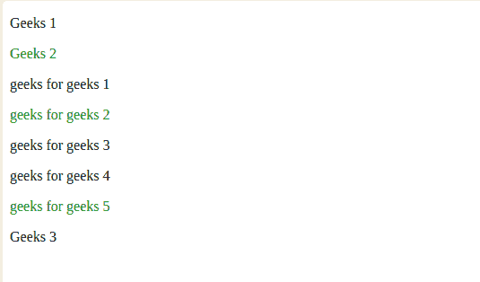

# jQuery |:第 n 个类型()选择器

> 原文:[https://www.geeksforgeeks.org/jquery-nth-of-type-selector/](https://www.geeksforgeeks.org/jquery-nth-of-type-selector/)

**:第 n 个类型()**是 **jQuery** 中的内置选择器，用于选择指定父元素的所有第 n 个子元素。
**语法:**

```
 parent_name : nth-of-type(n|even|odd|algebraic equation)
```

**参数:**取一个参数 **n |偶|奇|代数方程。**

<figure class="table">

| 价值 | 描述 |
| **n** | Select the child that appears at the nth index (starting from 1). N must be an integer. |
| **Even number** | Select the child that appears at the even index. |
| **Odd number** | Select the child that appears at the odd index. |
| **algebraic equation** | Select the sub-equation that appears at the value of the equation. The equation should be of mn+c or Mn–C type, where M and C are constant values. |

</figure>

**注:**

*   不同部分或分区中的子元素被区别对待
    ，即索引从开始开始。
*   在 mn + c 中，n 从值 0 开始。

**示例-1:** 使用 **n** 作为参数。

## 超文本标记语言

```
<!DOCTYPE html>
<html>

<head>
    <script src=
"https://ajax.googleapis.com/ajax/libs/jquery/3.3.1/jquery.min.js">
  </script>

  <script>
        $(document).ready(function() {
            $("p:nth-of-type(2)").css(
              "color", "green");
        });
    </script>
</head>

<body>

<p>Geeks 1</p>

<p>Geeks 2</p>

    <section>

    <!--Indices of child elements start
    from beginning inside new section-->

<p>geeks for geeks 1</p>

<p>geeks for geeks 2</p>

<p>geeks for geeks 3</p>

    </section>

    <!--Outside the section the index of
     the child element remain same as
      before section tag-->

<p>Geeks 3</p>

</body>

</html>
```

**输出:**



**在上面的示例中，**索引 2 处的子元素(父元素是 p 标记)被格式化为绿色，即“极客 2”和“极客 2 的极客”。

**示例-2:** 使用**甚至**作为参数。

## 超文本标记语言

```
<!DOCTYPE html>
<html>

<head>
    <script src=
"https://ajax.googleapis.com/ajax/libs/jquery/3.3.1/jquery.min.js">
  </script>

  <script>
        $(document).mouseover(function() {
            $("p:nth-of-type(even)").css(
              "background-color", "green");
        });
    </script>
</head>

<body>

<p>Geeks 1</p>

<p>Geeks 2</p>

    <section>
        <!--Indices of child elements start
        from beginning inside new section-->

<p>geeks for geeks 1</p>

<p>geeks for geeks 2</p>

<p>geeks for geeks 3</p>

    </section>

    <!--Outside the section the index of the
     child element remain same as before section tag-->

<p>Geeks 3</p>

</body>

</html>
```

**输出:**



**在上面的例子中，**偶数索引处的子元素(父元素是 p 标记)被格式化为绿色背景，即“极客 2”和“极客 2 的极客”。

**示例-3:** 使用**奇数**作为参数。

## 超文本标记语言

```
<!DOCTYPE html>
<html>

<head>
    <script src=
"https://ajax.googleapis.com/ajax/libs/jquery/3.3.1/jquery.min.js">
  </script>

  <script>
        $(document).mouseover(function() {
            $("p:nth-of-type(odd)").css(
              "color", "red");
        });
    </script>
</head>

<body>

<p>Geeks 1</p>

<p>Geeks 2</p>

    <section>
        <!--Indices of child elements
      start from beginning inside new section-->

<p>geeks for geeks 1</p>

<p>geeks for geeks 2</p>

<p>geeks for geeks 3</p>

    </section>

    <!--Outside the section the index
        of the child element remain
        same as before section tag-->

<p>Geeks 3</p>

</body>

</html>
```

**输出:**



**在上面的例子中，**奇数索引处的子元素(父元素是 p 标记)被格式化为红色，即“极客 1”、“极客 1 的极客”、“极客 3 的极客”和“极客 3”。
**示例-4:** 使用**代数方程**作为参数。

## 超文本标记语言

```
<!DOCTYPE html>
<html>

<head>
    <script src=
"https://ajax.googleapis.com/ajax/libs/jquery/3.3.1/jquery.min.js">
  </script>

  <script>
        $(document).mouseover(function() {
            $("p:nth-of-type(3n+2)").css(
              "color", "green");
        });
    </script>
</head>

<body>

<p>Geeks 1</p>

<p>Geeks 2</p>

    <section>
        <!--Indices of child elements
            start from beginning inside
            new section-->

<p>geeks for geeks 1</p>

<p>geeks for geeks 2</p>

<p>geeks for geeks 3</p>

<p>geeks for geeks 4</p>

<p>geeks for geeks 5</p>

    </section>

    <!--Outside the section the index
        of the child element remain
        same as before section tag-->

<p>Geeks 3</p>

</body>

</html>
```

**输出:**



**在上面的例子中，**索引值等于 3n + 2(父元素是 p 标记)的子元素被格式化为绿色，即“极客 2”、“极客 2 的极客”、“极客 5 的极客”。