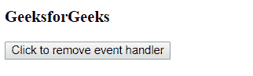
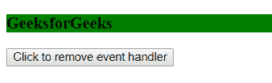
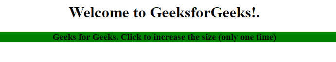
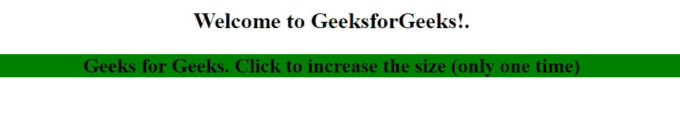

# jQuery | off()方法

> 原文:[https://www.geeksforgeeks.org/jquery-off-method/](https://www.geeksforgeeks.org/jquery-off-method/)

jQuery 中的 **off()方法**用于移除附带 on()方法的事件处理程序。off()方法给 API 带来了很多一致性，它取代了 unbind()，die()和 undelegate()方法。

**语法:**

```html
$(selector).off(event, selector, function(eventObj), map)
```

**参数:**该方法接受四个参数，如上所述，如下所述:

*   **事件:**为必选项，用于指定要从所选元素中移除的一个或多个事件或名称空间。多个事件由空格分隔。
*   **选择器:**它是可选参数，用于在附加事件处理程序时与最初传递给 on()方法的参数相匹配
*   **函数(eventObj):** 为可选参数，用于指定事件发生时要运行的函数。
*   **映射:**此参数用于指定事件映射**({事件:函数，事件:函数，…})** 包含一个或多个附加到元素的事件，以及事件发生时要运行的函数。

**示例 1:** 本示例删除事件处理程序。

```html
<!DOCTYPE html>
<html>

<head>
    <title>
        jQuery off() method
    </title>

    <script src=
"https://ajax.googleapis.com/ajax/libs/jquery/3.3.1/jquery.min.js">
    </script>

    <!-- Script to remove event handler -->
    <script>
        $(document).ready(function() {
            $("h3").on("click", function() {
                $(this).css("background-color", "green");
            });

            $("button").click(function() {
                $("h3").off("click");
            });
        });
    </script>
</head>

<body>
        <h3>GeeksforGeeks</h3> 

        <button>
            Click to remove event handler
        </button>
</body>

</html>
```

**输出:**
**之前点击元素 h3:**

**之后点击元素 h3:**


**示例 2:** 本示例使用动画事件一次添加动画效果，然后移除事件处理程序。

```html
<!DOCTYPE html>
<html>

<head>
    <title>
        jQuery off() method
    </title>

    <script src=
"https://ajax.googleapis.com/ajax/libs/jquery/3.3.1/jquery.min.js">
    </script>

    <!-- Script to animate the event -->
    <script>
        $(document).ready(function() {
            var x = 0;

            $("h3").click(function(event) {
                $("h3").animate({fontSize: "+=10px"
            });

            x++;

            if (x >= 1) {
                $(this).off(event);
            }
            });
        });
    </script>
</head>

<body style="text-align:center;">

    <h1>Welcome to GeeksforGeeks!.</h1> 

    <div style="background-color:green;">
        <h3>
            Geeks for Geeks. Click to increase
            the size (only one time)
        </h3>    
    </div>
</body>

</html>
```

**输出:**
**点击标题前:**

**点击标题后:**
