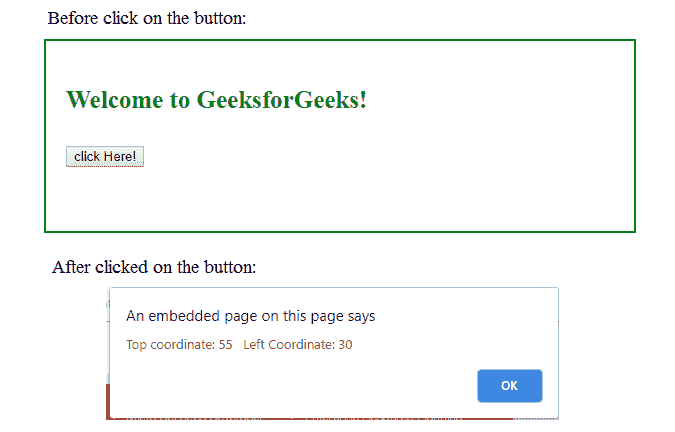
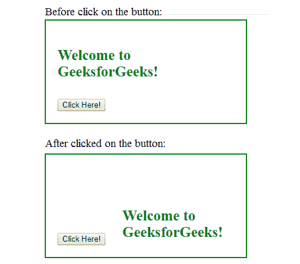

# jQuery | offset()带示例

> 原文:[https://www.geeksforgeeks.org/jquery-offset-with-examples/](https://www.geeksforgeeks.org/jquery-offset-with-examples/)

offset()方法是 jQuery 中的一个内置方法，用于设置或返回所选元素的偏移坐标。
**语法:**

```html
$(selector).offset()
```

*   **参数:**参数不需要。

```html
$(selector).offset({top:value, left:value})
```

*   **参数:**设置偏移量时需要该参数。

```html
$(selector).offset( function(index, offset) )
```

*   **参数:**该方法使用函数设置偏移量。此方法中使用的参数是可选的。索引参数用于返回集合元素的位置，偏移量返回选定元素的坐标。

**返回值:**该方法返回匹配元素的坐标。
以下示例说明 jQuery 中的 offset()方法:
**示例 1:** 在下面的代码中，这将返回第一个匹配元素的坐标。

## 超文本标记语言

```html
<!DOCTYPE html>
<html>
    <head>
        <title>The offset Method</title>
        <script src=
        "https://ajax.googleapis.com/ajax/libs/jquery/3.3.1/jquery.min.js">
        </script>

        <!-- jQuery code to show the working of this method -->
        <script>
            $(document).ready(function() {
                $("button").click(function() {
                    var Geek = $("p").offset();
                    alert("Top coordinate: " + Geek.top +
                             "   Left Coordinate: " + Geek.left);
                });
            });
        </script>
        <style>
            div {
                width: 60%;
                min-height: 150px;
                padding: 20px;
                font-size: 25px;
                border: 2px solid green;
                font-weight: bold;
                color:green;
            }
        </style>
    </head>

    <body>
        <!-- Click on paragraph -->
        <div>

<p>Welcome to GeeksforGeeks!</p>

            <button>click Here!</button>
        </div>
    </body>
</html>
```

**输出:**



**例 2:**

## 超文本标记语言

```html
<!DOCTYPE html>
<html>
   <head>
       <title>The offset Method</title>
       <script src=
       "https://ajax.googleapis.com/ajax/libs/jquery/3.3.1/jquery.min.js">
       </script>

       <!-- jQuery code to show the working of this method -->
       <script>
            $(document).ready(function() {
                $("button").click(function() {
                    $("p").offset({top: 100, left: 140});
             });
         });
      </script>
      <style>
         div{
             width: 300px;
             min-height: 100px;
             color:green;
             font-weight: bold;
             padding:20px;
             font-size: 25px;
             border: 2px solid green;
         }
      </style>
   </head>
   <body>
      <div>
         <!-- Click on paragraph -->

<p>Welcome to GeeksforGeeks!</p>

         <button>Click Here!</button>
      </div>
   </body>
</html>
```

**输出:**

