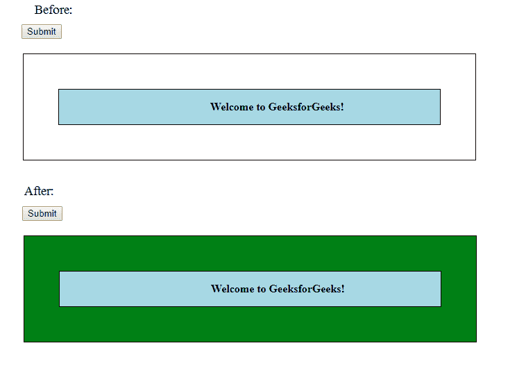

# jQuery | offsetParent()带示例

> 原文:[https://www . geeksforgeeks . org/jquery-offsetparent-with-example/](https://www.geeksforgeeks.org/jquery-offsetparent-with-example/)

offsetParent()方法是 jQuery 中的一个内置方法，用于查找 DOM 树中第一个定位的父元素。
**语法:**

```
$(selector).offsetParent()
```

**参数:**该方法不包含任何参数。
**返回值:**这个方法返回第一个定位的父元素。
以下示例说明了 jQuery 中的 offsetParent()方法:
**示例:**

## 超文本标记语言

```
<!DOCTYPE html>
<html>
   <head>
       <title>The offsetParent Method</title>
      <script src=
      "https://ajax.googleapis.com/ajax/libs/jquery/3.3.1/jquery.min.js">
      </script>

      <!-- jQuery code to show the working of this method -->
      <script>
         $(document).ready(function(){
             $("button").click(function(){
                 $("p").offsetParent().css("background-color", "green");
             });
         });
      </script>
      <style>
         #d1 {
             border:1px solid black;
             width:70%;
             position:absolute;
             left:10px;
             top:50px
         }
         #d2 {
             border:1px solid black;
             margin:50px;
             background-color:lightblue;
             text-align:center;
         }
         p {
             padding-left: 80px;
             font-weight: bold;
         }
      </style>
   </head>
   <body>
       <button>Submit</button>
      <div id="d1">
         <div id="d2">
            <!-- click on this paragraph -->

<p>Welcome to GeeksforGeeks!</p>

         </div>
      </div>
   </body>
</html>
```

**输出:**



**相关文章:**

*   [jQuery | addBack()带示例](https://www.geeksforgeeks.org/jquery-addback-with-examples/)
*   [jQuery | addClass()带示例](https://www.geeksforgeeks.org/jquery-addclass-with-examples/)