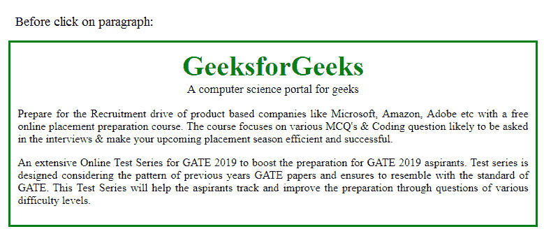
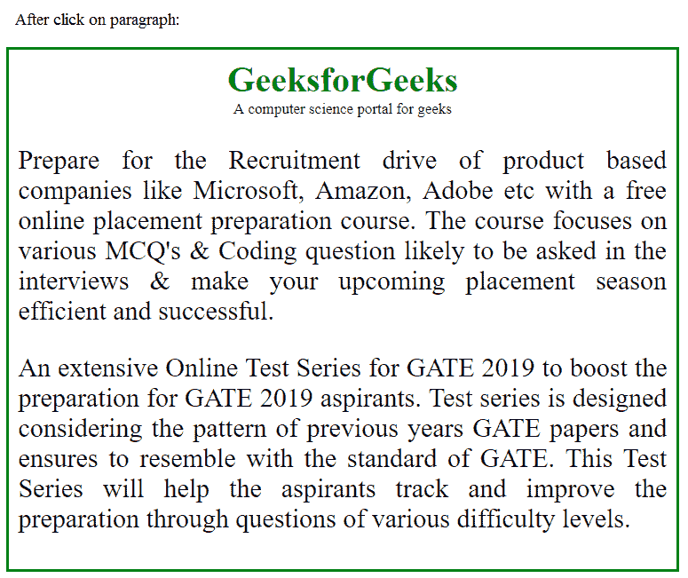

# jQuery | one()带示例

> 原文:[https://www.geeksforgeeks.org/jquery-one-with-examples/](https://www.geeksforgeeks.org/jquery-one-with-examples/)

one()方法是 jQuery 中的一个内置方法，它为所选元素附加一个或多个事件处理程序。这还附加了一个在事件发生时运行的函数。此方法命名为 one，因为附加到此方法的任何事件处理程序都将只运行一次。

**语法:**

```html
$(selector).one(event, data, function)
```

**参数:**该方法接受三个参数，如上所述，如下所述:

*   **事件:**必选参数。它用于指定要附加到元素的一个或多个事件。如果给定多个事件，则使用空格将它们分开。
*   **数据:**为可选参数。它用于指定传递给函数的附加数据。
*   **功能:**必选参数。它用于指定事件发生时要运行的函数。

**返回值:**这个方法用指定的事件处理程序返回选中的元素。

**程序:**

```html
<!DOCTYPE html>
<html>
    <head>
        <script src=
        "https://ajax.googleapis.com/ajax/libs/jquery/3.3.1/jquery.min.js">
        </script>
        <script>

            // jQuery code to show the working of this method
            $(document).ready(function() {
                $("p").one("click", function() {
                    $(this).animate({
                        fontSize: "+=14px"
                    });
                });
            });
        </script>
        <style>
            .para {
                margin: auto;
                width: 80%;
                border: 3px solid green;
                padding: 10px;
                text-align:justify;
            }
            .gfg {
                font-size:40px;
                color:green;
                font-weight:bold;
                text-align:center;
            }
            .geeks {
                font-size:17px;
                text-align:center;
            }
        </style>
    </head>

    <body>
        <div class = "para">
            <div class = "gfg">GeeksforGeeks</div>
            <div class = "geeks">A computer science portal for geeks</div>
            <p>Prepare for the Recruitment drive of product based
            companies like Microsoft, Amazon, Adobe etc with a free
            online placement preparation course. The course focuses
            on various MCQ's & Coding question likely to be asked 
            in the interviews & make your upcoming placement season
            efficient and successful.</p>
            <p>An extensive Online Test Series for GATE 2019 to boost
            the preparation for GATE 2019 aspirants. Test series is
            designed considering the pattern of previous years GATE
            papers and ensures to resemble with the standard of GATE.
            This Test Series will help the aspirants track and improve
            the preparation through questions of various difficulty
            levels. </p>
        </div>
    </body>
</html>
```

**输出:**

