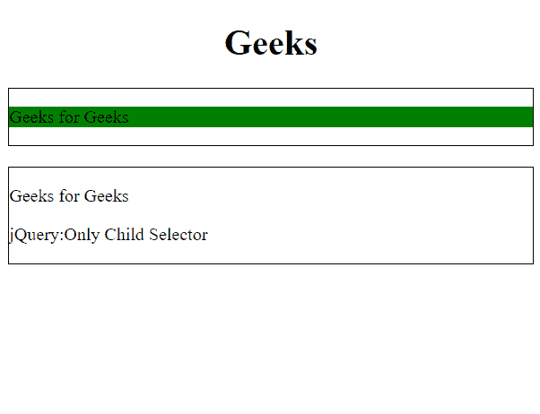
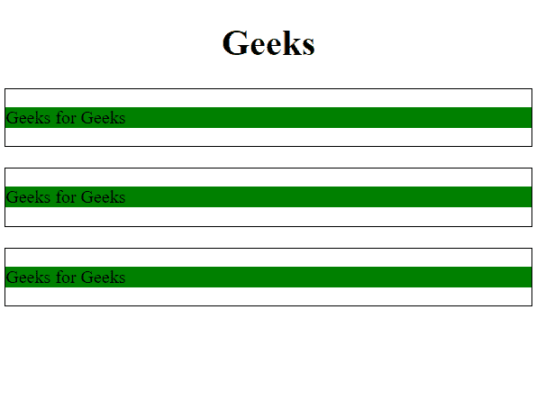

# jQuery |:独生子选择器

> 原文:[https://www.geeksforgeeks.org/jquery-only-child-selector/](https://www.geeksforgeeks.org/jquery-only-child-selector/)

这是一个 jQuery Selector，用于选择作为其**父级**的**独生子**的每个元素，即只选择单个子元素。

**语法:**

```html
$(":only-child")
```

**返回值:**选择并返回其父元素的唯一子元素。

**示例-1:**

```html
<!DOCTYPE html>
<html>
<h1>
  <center>
    Geeks
  </center>
  </h1>

<head>
    <script src=
"https://ajax.googleapis.com/ajax/libs/jquery/3.3.1/jquery.min.js">
  </script>
  <script>
        $(document).ready(function() {
            $("p:only-child").css(
              "background-color", "green");
        });
    </script>
</head>

<body>
    <div style="border:1px solid;">
        <p>Geeks for Geeks</p>
    </div>
    <br>

    <div style="border:1px solid;">
        <p>Geeks for Geeks</p>
        <p>jQuery:Only Child Selector</p>
    </div>
    <br>
</body>

</html>
```

**输出:**


**示例-2:**

```html
<!DOCTYPE html>
<html>
<h1>
  <center>
    Geeks
  </center>
  </h1>

<head>
    <script src=
"https://ajax.googleapis.com/ajax/libs/jquery/3.3.1/jquery.min.js">
  </script>

  <script>
        $(document).ready(function() {
            $("p:only-child").css(
              "background-color", "green");
        });
    </script>
</head>

<body>
    <div style="border:1px solid;">
        <p>Geeks for Geeks</p>
    </div>
    <br>

    <div style="border:1px solid;">
        <p>Geeks for Geeks</p>
    </div>
    <br>

    <div style="border:1px solid;">
        <p>Geeks for Geeks</p>
    </div>
    <br>

</body>

</html>
```

**输出:**
