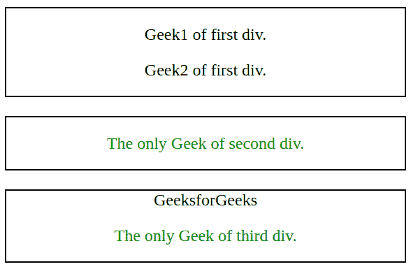
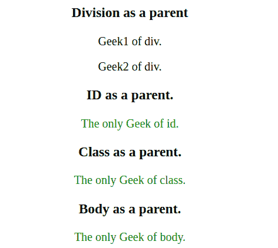

# jQuery |:唯一类型选择器

> 原文:[https://www.geeksforgeeks.org/jquery-only-of-type-selector/](https://www.geeksforgeeks.org/jquery-only-of-type-selector/)

**:唯一类型选择器**是 jQuery 中的一个内置选择器，用于选择其父元素的唯一子元素。
**语法:**

```
$("parent_name : only-of-type")

```

**示例-1:**

```
<!DOCTYPE html>
<html>

<head>
    <script src=
"https://ajax.googleapis.com/ajax/libs/jquery/3.3.1/jquery.min.js">
    </script>

    <!-- Script to use only-of-type selector -->

    <script>
        $(document).ready(function() {
            $("p:only-of-type").css(
              "color", "green");
        });
    </script>
</head>

<body>
    <center>

        <!-- Division 1 -->

        <div style="border:1px solid;">
            <p>Geek1 of first div.</p>
            <p>Geek2 of first div.</p>
        </div>
        <br>

        <!-- Division 2 -->

        <div style="border:1px solid;">
            <p>The only Geek of second div.</p>
        </div>
        <br>

        <!-- Division 3 -->

        <div style="border:1px solid;">
            <span>GeeksforGeeks</span>
            <p>The only Geek of third div.</p>
        </div>
    </center>
</body>

</html>
```

**输出:**


在上面的例子中，其父元素(这里是 div 标签)的所有唯一子元素(这里是 p 标签)都被格式化为绿色，即“第二个 div 的唯一 Geek。”和“第三部门唯一的极客。”。

**示例-2:**

```
<!DOCTYPE html>
<html>

<head>
    <script src=
"https://ajax.googleapis.com/ajax/libs/jquery/3.3.1/jquery.min.js">
    </script>

    <!-- Script to use only-of-type selector -->

    <script>
        $(document).ready(function() {
            $("p:only-of-type").css(
              "color", "green");
        });
    </script>
</head>

<body>
    <center>

        <!-- Children of division -->

        <h3>Division as a parent</h3>
        <div>
            <p>Geek1 of div.</p>
            <p>Geek2 of div.</p>
        </div>

        <!-- Only child of id -->

        <h3>ID as a parent.</h3>
        <id>
            <p>The only Geek of id.</p>
        </id>

        <!-- Only child of class -->

        <h3>Class as a parent.</h3>
        <class>
            <p>The only Geek of class.</p>
        </class>

        <!-- Only child of body -->

        <h3>Body as a parent.</h3>
        <p>The only Geek of body.</p>
    </center>
</body>

</html>
```

**输出:**


在上面的例子中，它们各自父元素的所有唯一子元素(这里是 p 标签)都被格式化为绿色，即“id 的唯一极客”，“班上唯一的极客。”和“身体中唯一的极客。”因为每个段落标签被认为是每个父级的不同子级。