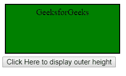

# jQuery | outerHeight()方法

> 原文:[https://www.geeksforgeeks.org/jquery-outerheight-method/](https://www.geeksforgeeks.org/jquery-outerheight-method/)

jQuery 中的 **outerHeight()** 方法用于查找指定元素的外部高度。元素的外部高度包括填充和边框。

**语法:**

```html
$(selector).outerHeight(includeMargin)
```

**参数:**该方法接受单参数**包括可选的**。它包含布尔值，用于指定是否包含边距。如果 includeMargin 设置为 true，则包含边距，否则不包含边距。默认情况下，includeMargin 设置为 false。

下面的例子说明了 jQuery 中的 outerWidth()方法:

**示例:**本示例显示元素的外部高度。

```html
<!DOCTYPE html>
<html>

<head>
    <script src=
"https://ajax.googleapis.com/ajax/libs/jquery/3.3.1/jquery.min.js">
    </script>

    <!-- Script to return outer height -->
    <script>
        $(document).ready(function() {
            $("button").click(function() {
                alert("Outer height of div: "
                    + $("div").outerHeight());
            });
        });
    </script>

    <!-- Style to create box using padding
            and margin -->
    <style>
        .geeks {
            height: 80px;
            width: 200px;
            padding: 5px;
            margin: 5px;
            border: 2px solid black;
            background-color: green;
            text-align: center;
        }
    </style>
</head>

<body>

    <div class="geeks">
        GeeksforGeeks
    </div>

    <button>Click Here to display outer height</button>

</body>

</html>                    
```

**输出:**
**点击按钮前:**

**点击按钮后:**
