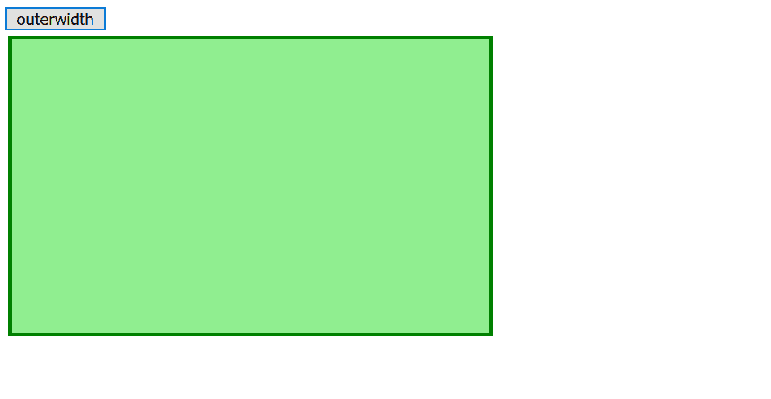
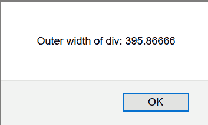

# jQuery | outwidth()方法

> 原文:[https://www.geeksforgeeks.org/jquery-outerwidth-method/](https://www.geeksforgeeks.org/jquery-outerwidth-method/)

jQuery 中的**外宽度()方法**用于返回包含边框&填充的元素的外宽度值。

**语法:**

```
$(selector).outerWidth( includemargin )
```

**参数:**该方法接受单参数**包括可选的**。它包含布尔值，用于指定是否包含边距。如果 includeMargin 设置为 true，则包含边距，否则不包含边距。默认情况下，includeMargin 设置为 false。

**示例 1:** 本示例显示包括边距在内的外部宽度。

```
<!DOCTYPE html>
<html>

<head>
    <title>
        jQuery outerWidth() Method
    </title>

    <!-- Style to create box -->
    <style>
        .GFG {
            height: 200px;
            width: 350px;
            padding: 20px;
            margin: 3px;
            border: 3px solid green;
            background-color: lightgreen;
        }
    </style>

    <script src=
"https://ajax.googleapis.com/ajax/libs/jquery/3.3.1/jquery.min.js">
    </script>

    <!-- Script to display outerWidth of
        box including margin -->
    <script>
        $(document).ready(function() {
            $("button").click(function(){
                alert("Outer width of div: " 
                + $("div").outerWidth(true));
            });
        });
    </script>
</head>

<body>

    <button>outerwidth</button>

    <div class="GFG"></div>

</body>

</html>
```

**之前点击按钮:**

**之后点击按钮:**


**示例 2:** 本示例显示外部宽度，不包括边距。

```
<!DOCTYPE html>
<html>

<head>
    <title>
        jQuery outerWidth() Method
    </title>

    <!-- Style to create box -->
    <style>
        .GFG {
            height: 200px;
            width: 350px;
            padding: 20px;
            margin: 3px;
            border: 3px solid green;
            background-color: lightgreen;
        }
    </style>

    <script src=
"https://ajax.googleapis.com/ajax/libs/jquery/3.3.1/jquery.min.js">
    </script>

    <!-- Script to display outer width excluding margin -->
    <script>
        $(document).ready(function() {
            $("button").click(function() {
                alert("Outer width of div: "
                + $("div").outerWidth());
            });
        });
    </script>
</head>

<body>
    <button>outerwidth</button>

    <div class = "GFG"></div>

</body>
</html>
```

**之前点击按钮:**

**之后点击按钮:**
