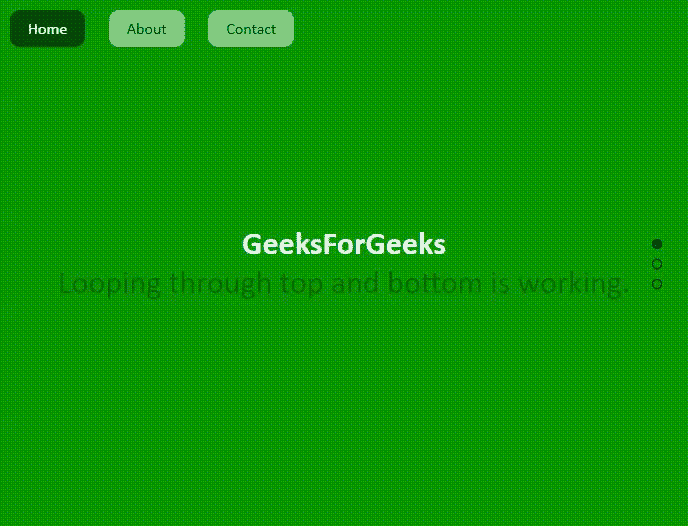
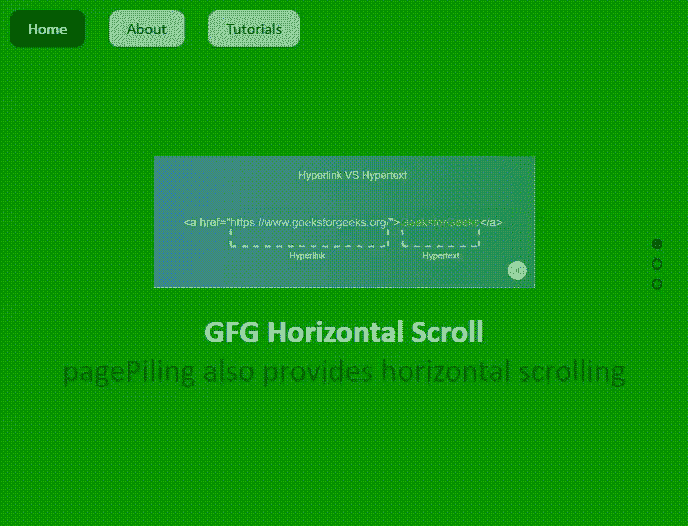

# jQuery |页面堆积插件

> 原文:[https://www.geeksforgeeks.org/jquery-page-piling-plugin/](https://www.geeksforgeeks.org/jquery-page-piling-plugin/)

jQuery**page pilling . js**插件是一个丰富的特性，可供程序员堆积多个布局部分，一个在另一个之上，通过 URL 或鼠标滚动或侧边项目符号导航访问每个页面。此功能为目的地锚点链接提供所有类型的平滑垂直、水平和侧面导航。它还管理回调函数、视频背景和滚动速度。在下面的例子中，我们将只讨论其中的几个。

**注意:**请从 [**页面下载以下库文件，并保存在您的工作文件夹中，以包含在您的代码中。请从这个**](https://github.com/alvarotrigo/pagePiling.js/)**[链接下载“example.css”文件。](https://github.com/alvarotrigo/pagePiling.js/tree/master/examples)**

**jQuery 页面链接插件:**

> <链接 href = " examples . CSS " rel = " style sheet " =【text/CSS "/><脚本 src = " http://Ajax . Google APIs . com/Ajax/libs/jquery/1 . 8 . 3/jquery . min . js ">t8/【script】

**示例 1:** 以下示例演示了用 jQuery 代码编写的**页面堆积**插件的基本工作。它支持带有背景图像的不同网页布局页面的交互式滚动。页面也可以通过右侧的侧边项目符号进行导航。

## 超文本标记语言

```html
<!DOCTYPE html>
<html xmlns="http://www.w3.org/1999/xhtml">

<head>
    <meta http-equiv="Content-Type"
          content="text/html; charset=utf-8" />
    <title>jQuery pagePiling plugin </title>
    <meta name="Resource-type"
          content="Document" />
    <link rel="stylesheet" type="text/css"
          href=
"http://fonts.googleapis.com/css?family=Lato:300, 400, 700" />
    <link rel="stylesheet"
          type="text/css"
          href="jquery.pagepiling.css" />
    <link rel="stylesheet"
          type="text/css"
          href="examples.css" />

    <script src=
"http://ajax.googleapis.com/ajax/libs/jquery/1.8.3/jquery.min.js">
  </script>

    <script type="text/javascript"
            src="jquery.pagepiling.min.js">
    </script>
    <script type="text/javascript">
        var deleteLog = false;

        $(document).ready(function() {
            $('#pagepiling').pagepiling({
                menu: '#menu',
                anchors: ['page1', 'page2', 'page3'],
                navigation: {
                    'textColor': '#f0f2f0',
                    'bulletsColor': '#ccc000',
                    'position': 'right',
                    'tooltips': ['Page 1', 'Page 2', 'Page 3', 'Page 4']
                }
            });
        });
    </script>

    <style>
        h1 {
            font-size: 5em;
            font-family: arial, helvetica;
            color: #fff;
            margin: 0;
            padding: 0;
        }

        .section {
            text-align: center;
        }

        #section1,
        #section2,
        #section3 {
            background-size: cover;
        }

        #section1 {
            background-image: url(images/background1.jpg);
        }

        #section2 {
            background-image: url(images/background2.jpg);
            padding: 6% 0 0 0;
        }

        #section3 {
            background-image: url(images/background3.jpg);
            padding: 6% 0 0 0;
        }

        #section3 h1 {
            color: #000;
        }

        #section1 h1 {
            position: absolute;
            left: 0;
            right: 0;
            margin: 0 auto;
            top: 30px;
            color: #fff;
        }

        #section2 .intro {
            position: absolute;
            left: 0;
            right: 0;
            margin: 0 auto;
            top: 30px;
        }

        #section2 h1,
        #section2 p {
            text-shadow: 1px 5px 20px #000;
        }

        #section3 h1,
        #section3 p {
            text-shadow: 1px 5px 20px #000;
            color: #fff;
        }
    </style>

</head>

<body>

    <ul id="menu">
        <li data-menuanchor="page1"
            class="active">
          <a href="#page1">Home</a></li>
        <li data-menuanchor="page2">
          <a href="#page2">About</a></li>
        <li data-menuanchor="page3">
          <a href="#page3">jQuery</a></li>
    </ul>

    <div id="pagepiling">
        <div class="section" id="section1">
            <h1>GeeksForGeeks</h1>
        </div>
        <div class="section" id="section2">
            <div class="intro">
                <h1>GFG Backgrounds </h1>

<p>All pages with layouts!</p>

            </div>
        </div>
        <div class="section" id="section3">
            <div class="intro">
                <h1>Learn Jquery </h1>

<p>Its fun learning plugins.</p>

            </div>
        </div>
    </div>
</body>

</html>
```

**输出:**


**示例 2:** 在以下示例中，顶部和底部循环特征被启用。为此， *loopTop* 和 *loopBottom* 属性设置为“真”，如 jQuery 代码所示。

## 超文本标记语言

```html
<!DOCTYPE html>
<html xmlns="http://www.w3.org/1999/xhtml">

<head>
    <meta http-equiv="Content-Type"
          content="text/html; charset=utf-8" />
    <title>jQuery pagePiling plugin for Looping</title>
    <meta name="Resource-type" content="Document" />

    <link rel="stylesheet" type="text/css"
          href="jquery.pagepiling.css" />
    <link rel="stylesheet" type="text/css"
          href="examples.css" />

    <script src=
"http://ajax.googleapis.com/ajax/libs/jquery/1.8.3/jquery.min.js">
    </script>
    <script type="text/javascript" src="jquery.pagepiling.min.js">
    </script>

    <script type="text/javascript">
        var deleteLog = false;

        $(document).ready(function() {
            $('#pagepilingDivID').pagepiling({
                menu: '#menu',
                anchors: ['page1', 'page2', 'page3'],
                sectionsColor: [
                  'green', 'lime', 'forestgreen', 'darkgreen'],
                loopTop: true,
                loopBottom: true
            });
        });
    </script>
</head>

<body>
    <ul id="menu">
        <li data-menuanchor="page1" class="active">
            <a href="#page1">Home</a></li>
        <li data-menuanchor="page2">
          <a href="#page2">About</a></li>
        <li data-menuanchor="page3">
          <a href="#page3">Contact</a></li>
    </ul>

    <div id="pagepilingDivID">
        <div class="section" id="section1">
            <h1>GeeksForGeeks</h1>

<p>Looping through top and bottom is working.</p>

        </div>
        <div class="section" id="section2">
            <div class="intro">
                <h1>Page Piling in a Looping style</h1>

<p>To see the looping page piling feature,
                  just use the PgUp and PgDn scroll keys .</p>

            </div>
        </div>
        <div class="section" id="section4">
            <div class="intro">
                <h1>Back to the first page after scrolling down.</h1>

<p>And it shows a looping feature, scrolling
                  down till the end gets back the first section.</p>

            </div>
        </div>
    </div>
</body>

</html>
```

**输出:**



**示例 3:** 在以下示例中，通过设置选项*方向来启用页面的水平滚动:“水平”*，如 jQuery 代码所示。

## 超文本标记语言

```html
<!DOCTYPE html>
<html xmlns="http://www.w3.org/1999/xhtml">

<head>
    <meta http-equiv="Content-Type"
        content="text/html; charset=utf-8" />

    <title>
        jQuery pagePiling plugin for
        Horizontal scroll
    </title>

    <link rel="stylesheet" type="text/css"
        href="jquery.pagepiling.css" />

    <link rel="stylesheet" type="text/css"
        href="examples.css" />

    <script src=
"http://ajax.googleapis.com/ajax/libs/jquery/1.8.3/jquery.min.js">
    </script>

    <script type="text/javascript"
        src="jquery.pagepiling.min.js">
    </script>

    <script type="text/javascript">
        $(document).ready(function () {

            $('#pagepilingDivID').pagepiling({
                direction: 'horizontal',
                menu: '#menu',
                anchors: ['page1', 'page2', 'page3', 'page4'],
                sectionsColor: [
                    'green', 'forestgreen', 'lime', 'white'],
                navigation: {
                    'position': 'right',
                    'tooltips': [
                        'Page 1', 'Page 2', 'Page 3', 'Page 4']
                },

            });
        });
    </script>

    <style>
        #section1 img {
            margin: 20px 0;
            opacity: 0.7;
        }

        #colors2,
        #colors3 {
            position: absolute;
            height: 150px;
            width: 370px;
            z-index: 1;
            background-repeat: no-repeat;
            left: 0;
            margin: 0 auto;
            right: 0;
        }

        #colors2 {
            background-image: url(images/colors2.png);
            top: 0;
        }

        #colors3 {
            background-image: url(images/colors3.png);
            bottom: 0;
        }
    </style>

</head>

<body>
    <ul id="menu">
        <li data-menuanchor="page1" class="active">
            <a href="#page1">Home</a>
        </li>
        <li data-menuanchor="page2">
            <a href="#page2">About</a>
        </li>
        <li data-menuanchor="page3">
            <a href="#page3">Tutorials</a>
        </li>
    </ul>

    <div id="pagepilingDivID">
        <div class="section" id="section1">
            
            <br />

            <h1>GFG Horizontal Scroll</h1>

<p>
                pagePiling also provides
                horizontal scrolling
            </p>

        </div>
        <div class="section">
            <div class="intro">
                <h1>Highly flexible and configurable</h1>

<p>
                    Do the horizontal way of
                    scrolling and check!
                </p>

            </div>
        </div>
        <div class="section" id="section3">
            <div class="intro">
                <h1>Very interactive for users</h1>

<p>Great idea to include in websites</p>

            </div>
        </div>
    </div>
</body>

</html>
```

**输出:**

