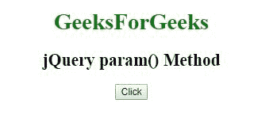
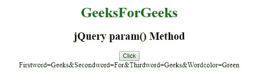
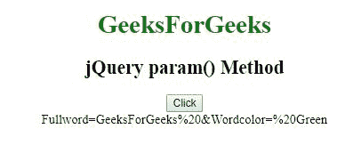

# jQuery | param()方法

> 原文:[https://www.geeksforgeeks.org/jquery-param-method/](https://www.geeksforgeeks.org/jquery-param-method/)

jQuery 中的**参数()方法**用于创建对象的序列化表示。

**语法:**

```html
$.param( object, trad )
```

**参数:**该方法接受两个参数，如上所述，如下所述:

*   **对象:**是强制参数，用于指定要序列化的数组或对象。
*   **trad:** 为可选参数，用于指定是否使用传统样式的参数序列化。

**示例 1:** 本示例使用 param()方法创建对象的序列化表示。

```html
<!DOCTYPE html>
<html>

<head> 
    <title>
        jQuery param() Method
    </title>

    <script src=
"https://ajax.googleapis.com/ajax/libs/jquery/3.3.1/jquery.min.js">
    </script>
</head> 

<body style="text-align:center;">

    <h1 style = "color:green;" >  
        GeeksForGeeks
    </h1>  

    <h2>jQuery param() Method</h2>

    <button>Click</button>

    <div></div>

    <!-- Script using param() method -->
    <script>
        $(document).ready(function() {

            personObj = new Object();

            personObj.Firstword = "Geeks";
            personObj.Secondword = "For";
            personObj.Thirdword = "Geeks";
            personObj.Wordcolor = "Green"; 

            $("button").click(function() {
                $("div").text($.param(personObj));
            });
        });
    </script>
</body>

</html>  
```

**输出:**
**之前点击按钮:**

**之后点击按钮:**


**示例 2:** 本示例使用 param()方法创建对象的序列化表示。

```html
<!DOCTYPE html>
<html>

<head> 
    <title>
        jQuery param() Method
    </title>

    <script src=
"https://ajax.googleapis.com/ajax/libs/jquery/3.3.1/jquery.min.js">
    </script>
</head> 

<body style="text-align:center;">

    <h1 style = "color:green;" >  
        GeeksForGeeks
    </h1>  

    <h2>jQuery param() Method</h2>

    <button>Click</button>

    <div></div>

    <!-- Script using param() method -->
    <script>
        $(document).ready(function() {

            personObj = new Object();

            personObj.Fullword = "GeeksForGeeks ";
            personObj.Wordcolor = " Green"; 

            $("button").click(function(){
                $("div").text($.param(personObj));
            });
        });
    </script>
</body>

</html>  
```

**输出:**
**之前点击按钮:**

**之后点击按钮:**
