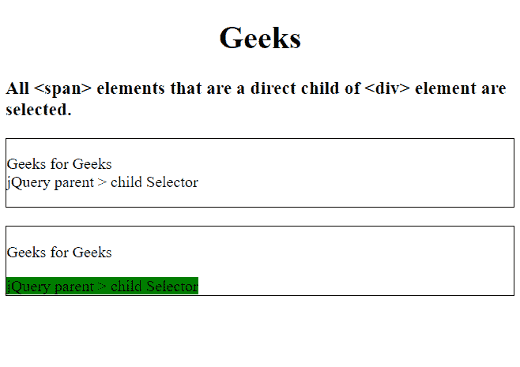
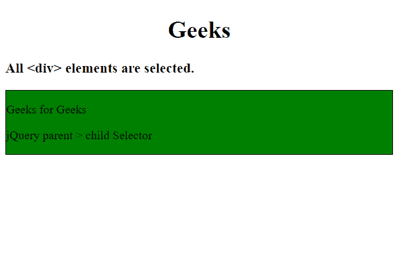

# jQuery |父级>子级选择器

> 原文:[https://www.geeksforgeeks.org/jquery-parent-child-selector/](https://www.geeksforgeeks.org/jquery-parent-child-selector/)

它是一个 jQuery 选择器，用于选择所有作为其父元素的直接子元素的元素。

**语法:**

```html
("parent > child")
```

**参数值:**

*   **父元素:**使用此选项，将选择父元素。
*   **子元素:**使用此选项，将选择指定父元素的直接子元素。

**返回值:**选择并返回指定父元素的所有直接子元素。

**示例-1:**

```html
<!DOCTYPE html>
<html>
<h1><center>Geeks </center></h1>

<head>
    <script src=
"https://ajax.googleapis.com/ajax/libs/jquery/3.3.1/jquery.min.js">
  </script>

  <script>
        $(document).ready(function() {
            $("div > span").css(
              "background-color", "green");
        });
    </script>
</head>

<body>
    <h3>All span elements that are 
      a direct child of <div>
      element are selected.</h3>

    <div style="border:1px solid black;">
        <p>Geeks for Geeks
            <br>
          <span>
            jQuery parent > child Selector
          </span></p>
    </div>
    <br>

    <div style="border:1px solid black;">
        <p>Geeks for Geeks</p>
        <span>
          jQuery parent > child Selector
      </span>
    </div>

</body>

</html>
```

**输出:**


**示例-2:**

```html
<!DOCTYPE html>

<html>
<h1><center>Geeks </center></h1>

<head>
    <script src=
"https://ajax.googleapis.com/ajax/libs/jquery/3.3.1/jquery.min.js">
  </script>
    <script>
        $(document).ready(function() {
            $("div").css(
              "background-color", "green");
        });
    </script>
</head>

<body>
    <h3>All div elements 
      are selected.</h3>

    <div style="border:1px solid black;">
        <p>Geeks for Geeks</p>
        <p>jQuery parent > child Selector
      </p>
    </div>

</body>

</html>
```

**输出:**
