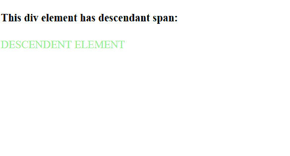

# jQuery |父代后代选择器

> 原文:[https://www . geesforgeks . org/jquery-父代-后代-选择器/](https://www.geeksforgeeks.org/jquery-parent-descendant-selector/)

**jQuery 父代后代选择器**选择特定(父)元素的后代元素。
**语法:**

```html
$("parent descendant")
```

**示例:**

## 超文本标记语言

```html
<!DOCTYPE html>
<html>

<head>
    <script src=
"https://ajax.googleapis.com/ajax/libs/jquery/3.3.1/jquery.min.js">
  </script>

  <script>
        $(document).ready(function() {
            $("div span").css("color",
                              "lightgreen");
        });
    </script>
</head>

<body>

    <h4>This div element has descendant span:</h4>
    <div>

        <span>DESCENDANT ELEMENT</span>
    </div>

</body>

</html>
```

**输出:**

