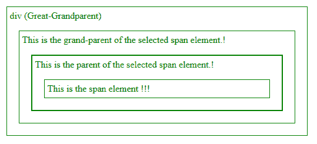
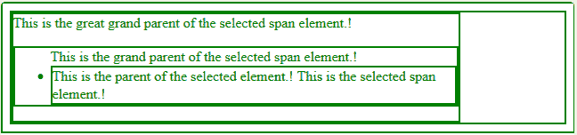

# jQuery | parent() & parents()带示例

> 原文:[https://www . geesforgeks . org/jquery-parent-parents-with-examples/](https://www.geeksforgeeks.org/jquery-parent-parents-with-examples/)

**parent()** 是 jQuery 中的一个内置方法，用于查找与所选元素相关的父元素。jQuery 中的 parent()方法遍历所选元素的单个层次并返回该元素。
**语法:**

```
$(selector).parent()

```

这里的选择器是其父元素需要查找的选定元素。
**参数:**不接受任何参数。
**返回值:**返回所选元素的父元素。
**显示该功能工作的 jQuery 代码:**

```
<html>

<head>
    <style>
        .main_div * {
            display: block;
            border: 1px solid green;
            color: green;
            padding: 5px;
            margin: 15px;
        }
    </style>
    <script 
    src="https://ajax.googleapis.com/ajax/libs/jquery/3.3.1/jquery.min.js">

    </script>
    <script>
        $(document).ready(function() {
            $("span").parent().css({
                "color": "green",
                "border": "2px solid green"
            });
        });
    </script>
</head>

<body>

  <div class="main_div">
    <div style="width:500px;">div (Great-Grandparent)
      <ul>This is the grand-parent of the selected span element.!
      <li>This is the parent of the selected span element.!
      <span>This is the span element !!!</span>
      </li>
      </ul>
    </div>
   </div>
</body>

</html>
```

在上面的代码中，只有所选元素的父元素是深绿色。
**输出:**


**parents()** 是 jQuery 中的一个内置方法，用于查找与所选元素相关的所有父元素。jQuery 中的 parents()方法遍历所选元素的所有级别，并返回所有元素。
**语法:**

```
$(selector).parents()

```

这里选择器是所有父元素都需要查找的选定元素。
**参数:**不接受任何参数。
**返回值:**返回所选元素的所有父元素。
**显示该功能工作的 jQuery 代码:**

```
<html>

<head>
    <style>
        .main_body* {
            display: block;
            border: 2px solid green;
            color: green;
            padding: 5px;
            margin: 15px;
        }
    </style>
<script 
    src="https://ajax.googleapis.com/ajax/libs/jquery/3.3.1/jquery.min.js">
</script>
<script>
        $(document).ready(function() {
            $("span").parents().css({
                "color": "green",
                "border": "2px solid green"
            });
        });
    </script>
</head>

<body class="main_body">
  <div style="width:500px;">This is the great grand parent of the selected span element.!
   <ul>This is the grand parent of the selected span element.!
   <li>This is the parent of the selected element.!
   <span>This is the selected span element.!</span>
   </li>
   </ul>
   </div>
</body>

</html>
```

在上面的代码中，所选的所有父元素都以深绿色显示。
**输出:**


jQuery 是一个开源的 JavaScript 库，它简化了 HTML/CSS 文档之间的交互，它以其“少写多做”的理念而闻名。
跟随本 [jQuery 教程](https://www.geeksforgeeks.org/jquery-tutorials/)和 [jQuery 示例](https://www.geeksforgeeks.org/jquery-examples/)可以从头开始学习 jQuery。