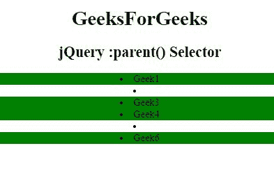

# jQuery |:父选择器

> 原文:[https://www.geeksforgeeks.org/jquery-parent-selector/](https://www.geeksforgeeks.org/jquery-parent-selector/)

jQuery 中的**:父选择器**用于选择其他元素的所有父元素，包括文本节点。

**语法:**

```html
$(":parent")
```

**示例:**

```html
<!DOCTYPE html>
<html>

<head>
    <title>
      jQuery :parent() Selector
  </title>
    <script src=
"https://ajax.googleapis.com/ajax/libs/jquery/3.3.1/jquery.min.js">
  </script>

  <script>
        $(document).ready(function() {
            $("li:parent").css(
              "background-color", "green");
        });
    </script>
</head>

<body>
    <center>
        <h1 id="geeks1">
          GeeksForGeeks</h1>
        <h2 id="geeks2">
          jQuery :parent() Selector
      </h2>

        <div>
            <li>Geek1</li>
            <li></li>
            <li>Geek3</li>
            <li>Geek4</li>
            <li></li>
            <li>Geek6</li>

        </div>
    </center>
</body>

</html>
```

**输出:**


**支持的浏览器:**支持的浏览器 **jQuery:父选择器**如下:

*   谷歌 Chrome
*   微软公司出品的 web 浏览器
*   火狐浏览器
*   歌剧
*   旅行队