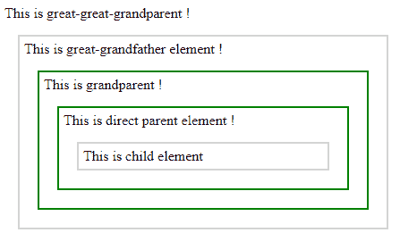

# jQuery | parentsUntil()带示例

> 原文:[https://www . geesforgeks . org/jquery-parentsuntil-with-example/](https://www.geeksforgeeks.org/jquery-parentsuntil-with-example/)

**parentsUntil()** 是 jQuery 中的一个内置方法，用于查找 DOM 树中两个给定元素之间的所有祖先元素。文档对象模型是一个万维网联盟标准。这定义了访问 DOM 树中的元素。
**语法:**

```html
$(selector1).parentsUntil(selector2)

```

**参数:**它接受参数“selector2”，这是树中所选元素的最后一个标记的父元素。
**返回值:**返回两个给定元素之间的所有祖先元素。
**jQuery 代码显示 parentsUntil()方法的工作方式:**

```html
<html>

<head>
    <style>
        .anc * {
            display: block;
            border: 2px solid lightgrey;
            color: black;
            padding: 5px;
            margin: 15px;
        }
    </style>
    <script src="https://ajax.googleapis.com/ajax/libs/
                jquery/3.3.1/jquery.min.js"></script>
    <script>
        $(document).ready(function() {
            $("span").parentsUntil("div").css({
                "color": "black",
                "border": "2px solid green"
            });
        });
    </script>
</head>

<body class="anc">
    This is great-great-grandparent !
    <div style="width:400px;">
        This is great-grandfather element !
        <ul>
            This is grandparent !
            <li>This is direct parent element !
                <span>This is child element</span>
            </li>
        </ul>
    </div>
</body>

</html>
```

在上面的代码中，“span”和“div”**之间的所有祖先元素都以绿色突出显示**。
**输出:**
