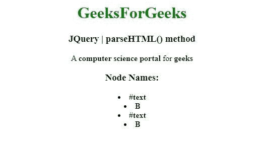

# JQuery | parseHTML()方法

> 原文:[https://www.geeksforgeeks.org/jquery-parsehtml-method/](https://www.geeksforgeeks.org/jquery-parsehtml-method/)

jQuery 中的这个 **parseHTML()** 方法用来将一个字符串解析成一个 DOM 节点的数组。

**语法:**

```
jQuery.parseHTML(data [, context ] [, keepScripts ])

```

**参数:**parseXML()方法接受上面提到的和下面描述的三个参数:

*   **数据:**这个参数是需要解析的 HTML 字符串。
*   **上下文:**此参数是用作将在其中创建 HTML 片段的上下文的文档元素。
*   **keepScripts :** 这个参数是布尔值，表示是否包含 HTML 字符串中传递的脚本。

**Return Value:**

**示例 1:** 在本例中，**解析 HTML()方法**将一个字符串解析成一个 DOM 节点数组。

```
<!DOCTYPE html>
<html>
<head>
<meta charset="utf-8">
<title>JQuery | parseHTML() method</title> 
<script src="https://code.jquery.com/jquery-3.4.1.js"></script>

</head>
<body style="text-align:center;"> 

    <h1 style="color: green"> 
        GeeksForGeeks 
    </h1> 

    <h3>JQuery | parseHTML() method</h3>
    <pre id="geek">
    </pre>

    <script>
        var $geek = $( "#geek" ),
          str = "A <b>computer science portal</b> for <b>geeks</b>",
          html = jQuery.parseHTML( str ),
          nodeNames = [];

        $geek.append( html );
    </script>
</body>
</html>                                                                                
```

**输出:**


**示例 2:** 在本例中，**解析 HTML()方法**使用 HTML 字符串创建一个 DOM 节点数组，并将其插入 div。

```
<!DOCTYPE html>
<html>
<head>
<meta charset="utf-8">
<title>JQuery | parseHTML() method</title> 
<script src="https://code.jquery.com/jquery-3.4.1.js"></script>

</head>
<body style="text-align:center;"> 

    <h1 style="color: green"> 
        GeeksForGeeks 
    </h1> 

    <h3>JQuery | parseHTML() method</h3>
    <div id="geek">
    </div>

    <script>
        var $geek = $( "#geek" ),
          str = "A <b>computer science portal</b> for <b>geeks</b>",
          html = jQuery.parseHTML( str ),
          nodeNames = [];

        $geek.append( html );

        $.each( html, function( i, el ) {
          nodeNames[ i ] = "<li>" + el.nodeName + "</li>";
        });

        $geek.append( "<h3>Node Names:</h3>" );
        $( "<b></b>" )
          .append( nodeNames.join( "" ) )
          .appendTo( $geek );
    </script>
</body>
</html>                            
```

**输出:**
