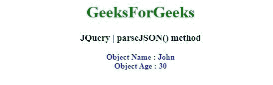
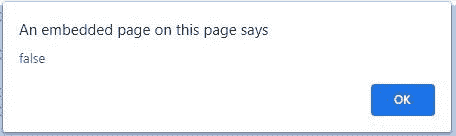

# JQuery | parseJSON()方法

> 原文:[https://www.geeksforgeeks.org/jquery-parsejson-method/](https://www.geeksforgeeks.org/jquery-parsejson-method/)

jQuery 中的这个 **parseJSON()** 方法采用一个格式良好的 JSON 字符串，并返回结果 JavaScript 值。

**语法:**

```html
jQuery.parseJSON( json )

```

**参数:**parseXML()方法只接受上面提到的一个参数，如下所述:

*   **json:** 这个参数是需要解析的格式良好的 json 字符串。

**Return Value:**

*   线*   数字*   目标*   排列*   Boolean

    **例 1:**

    ```html
    <!DOCTYPE html>
    <html>
    <head>
    <meta charset="utf-8">
    <title>JQuery | parseJSON() method</title> 
    <script src="https://code.jquery.com/jquery-3.4.1.js"></script>
    <style>
        #a {
            color: blue;
        }
        #b {
            color: red;
        }
    </style>
    </head>
    <body style="text-align:center;"> 

        <h1 style="color: green"> 
            GeeksForGeeks 
        </h1> 

        <h3>JQuery | parseJSON() method</h3>
        <b id="a"></b>

        <script>
        var txt = '{"name":"John", "age":30, "city":"New York"}'
        var obj = jQuery.parseJSON(txt);
        document.getElementById("a").innerHTML = 
    "Object Name : "+obj.name + "<br> Object Age : " + obj.age;
        </script>
    </body>
    </html>                                                                
    ```

    **输出:**
    

    **例 2:** 。

    ```html
    <!DOCTYPE html>
    <html>
    <head>
    <meta charset="utf-8">
    <title>JQuery | parseJSON() method</title> 
    <script src="https://code.jquery.com/jquery-3.4.1.js"></script>

    </head>
    <body style="text-align:center;"> 

        <h1 style="color: green"> 
            GeeksForGeeks 
        </h1> 

        <h3>JQuery | parseJSON() method</h3>
        <button onclick="gfg()">Click</button>

        <script>
            function gfg(){
                var txt = '{"name":"Shubham Singh", "age":21, "Cars":"ABC" }'
                var obj = jQuery.parseJSON(txt);
                alert( obj.name === "ABC" );
            }
            </script>
    </body>
    </html>                    
    ```

    **输出:**
    **点击前:**
    
    **点击后:**
    