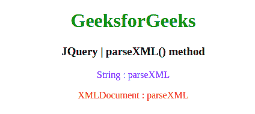
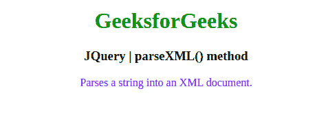

# JQuery | parseXML()方法

> 原文:[https://www.geeksforgeeks.org/jquery-parsexml-method/](https://www.geeksforgeeks.org/jquery-parsexml-method/)

jQuery 中的这个 **parseXML()** 方法用于将一个字符串解析成一个 XML 文档。

**语法:**

```
jQuery.parseXML( data )
```

**参数:**该方法接受上面提到的和下面描述的单个参数:

*   **数据:**此参数保存要解析的格式良好的 XML 字符串。

**返回值:**返回 XML 文档。

下面，请举例说明 jQuery 中的 **parseXML()方法**:
**示例 1:** 在本例中， **parseXML()方法**将字符串解析为 XML 文档。

```
<!DOCTYPE html>
<html>

<head>
    <meta charset="utf-8">
    <title>JQuery | parseXML() method</title>
    <script src=
"https://code.jquery.com/jquery-3.4.1.js">
    </script>
    <style>
        #a {
            color: blue;
        }

        #b {
            color: red;
        }
    </style>
</head>

<body style="text-align:center;">

    <h1 style="color: green"> 
        GeeksforGeeks 
    </h1>

    <h3>JQuery | parseXML() method</h3>
    <p id="a"></p>
    <p id="b"></p>

    <script>
        var xml = "<rss version='2.0'>"+
                    "<channel>"+ 
                      "<body>String : parseXML</body>"+
                     "</channel>"+
                  "</rss>",
            xmlDoc = $.parseXML(xml),
            $xml = $(xmlDoc),
            $body = $xml.find("body");

        $("#a").append($body.text());
        $body.text("XMLDocument : parseXML");
        $("#b").append($body.text());
    </script>
</body>

</html>
```

**输出:**


**例 2:** 。

```
<!DOCTYPE html>
<html>

<head>
    <meta charset="utf-8">
    <title>JQuery | parseXML() method</title>
    <script src=
"https://code.jquery.com/jquery-3.4.1.js">
    </script>
    <style>
        #a {
            color: blue;
        }

        #b {
            color: red;
        }
    </style>
</head>

<body style="text-align:center;">

    <h1 style="color: green"> 
        GeeksforGeeks 
    </h1>

    <h3>JQuery | parseXML() method</h3>
    <p id="a"></p>
    <p id="b"></p>

    <script>
        var xml = "<rss version='2.0'>"+
                    "<channel>"+
                      "<body style='text-align:center;'>"+
                        "<h1 style='color: green'>GeeksForGeeks</h1>"+
                        "<h3>JQuery | parseXML() method</h3>"+
                      "</body>"+
                    "</channel>"+
                  "</rss>",
            xmlDoc = $.parseXML(xml),
            $xml = $(xmlDoc),
            $val = $xml.find("h3");
        $val.text("Parses a string into an XML document.");
        $("#a").append($val.text());
    </script>
</body>

</html>    
```

**输出:**
