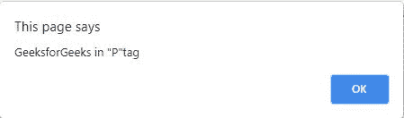

# jQuery 插件介绍

> 原文:[https://www.geeksforgeeks.org/jquery-plugins-introduction/](https://www.geeksforgeeks.org/jquery-plugins-introduction/)

插件是代码的一部分，这些代码写在一个 JavaScript 文件中。这些 JavaScript 文件用于提供与 jQuery 库方法协同工作的 jQuery 方法。

可以从[https://jquery.com/plugins](https://jquery.com/plugins)下载 jQuery 插件

[**如何用方法创建 Jquery 插件:**](https://www.geeksforgeeks.org/how-to-create-a-jquery-plugin-with-methods/) 在 jQuery 插件中是一个标准 javascript 文件中需要的代码。插件有助于提供不同的方法，这些方法可以与不同的 jquery 库方法一起使用。

*   创建一个方法。

    ```html
    jQuery.fn.methodName = methodDefinition;
    ```

*   要获得完美或兼容的代码，请使用此*。每个*用于在一组匹配的元素上执行。
*   前缀应以. js 结尾。

<> p **注:**所在*。方法名*是方法的名称，方法定义定义方法

**示例:** 下面是一个插件示例。

## alert.js

```html
jQuery.fn.alertMethod = function() {
   return this.each(function() {
      alert('GeeksforGeeks in "' + $(this).prop("tagName") + '"tag');
   });
};
```

## index.html

```html
<html>
   <head>

      <script type = "text/javascript" 
         src = 
"https://ajax.googleapis.com/ajax/libs/jquery/2.1.3/jquery.min.js">
      </script>

      <script src = "alert.js" type = "text/javascript">
      </script>

      <script type = "text/javascript" language = "javascript">
         $(document).ready(function() {
            $("p").alertMethod();
         });
      </script> 
   </head>

   <body>

<p>GeeksforGeeks</p>

   </body>
</html>
```

**输出:**



[**如何检查 jQuery 插件是否加载:**](https://www.geeksforgeeks.org/how-to-check-if-a-jquery-plugin-is-loaded/)

*   **步骤 1:** 使用 [npm](https://www.geeksforgeeks.org/node-js-npm-node-package-manager/) 安装 [**浏览器同步**](https://www.browsersync.io/) 。我们将使用浏览器同步启动一个服务器，并提供一个网址来查看 HTML 网站，并使用内容交付网络加载 **jQuery** 。我们将在全球范围内安装浏览器同步。

```html
npm install -g browser-sync
```

*   **第二步:**我们将在本教程中使用 [**jQuery-UI**](https://jqueryui.com/) 插件。我们将使用 jQuery 测试这个插件是否成功加载。下载这个插件的最新版本，并将其解压到您的项目根文件夹中。
*   **步骤 3:** 创建一个**index.html**文件

**完整参考:**

*   [jQuery 插件完整参考](https://www.geeksforgeeks.org/jquery-plugins-complete-reference/)