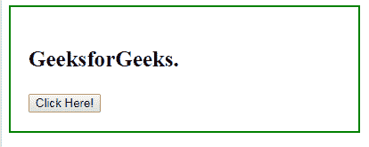
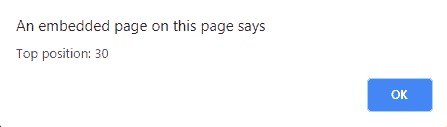

# jQuery | position()带示例

> 原文:[https://www . geesforgeks . org/jquery-position-with-examples/](https://www.geeksforgeeks.org/jquery-position-with-examples/)

position()方法是 jQuery 中的一个内置方法，用于查找 DOM 树中第一个匹配元素相对于其父元素的位置。

**语法:**

```html
$(selector).position()
```

**参数:**该方法不包含任何参数。
**返回值:**此方法返回第一个匹配元素的位置。
以下示例说明 jQuery 中的 position()方法:
**示例:**

## 超文本标记语言

```html
<!DOCTYPE html>
<html>
   <head>
       <title>The position Method</title>
      <script src=
      "https://ajax.googleapis.com/ajax/libs/jquery/3.3.1/jquery.min.js">
      </script>

      <!-- jQuery code to show the working of this method -->
      <script>
         $(document).ready(function(){
             $("button").click(function(){
                 var x = $("p").position();
                 alert("Top position: " + x.top);
             });
         });
      </script>
      <style>
         div {
             width: 350px;
             height: 100px;
             font-weight: bold;
             padding:20px;
             font-size: 25px;
             border: 2px solid green;
         }
      </style>
   </head>
   <body>
      <div>

<p>GeeksforGeeks.</p>

         <!-- Click on this button  -->
         <button>Click Here!</button>
      </div>
   </body>
</html>
```

**输出:**
之前点击按钮:



点击按钮后:



**相关文章:**

*   [jQuery | on()带示例](https://www.geeksforgeeks.org/jquery-on-with-examples/)
*   [jQuery | first()带示例](https://www.geeksforgeeks.org/jquery-first-with-examples/)