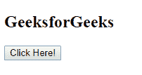
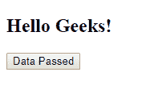

# jQuery | post()方法

> 原文:[https://www.geeksforgeeks.org/jquery-post-method/](https://www.geeksforgeeks.org/jquery-post-method/)

jQuery 中的 **post()方法**使用 POST HTTP 请求从服务器加载页面，并返回 **XMLHttpRequest** 对象。

**语法:**

```html
 $.post( url, data, callback_function, data_type )
```

**参数:**该方法接受上述和下述四个参数:

*   **url:** 为必输参数，用于发送请求。
*   **数据:**为可选参数，代表将发送到服务器的数据的键/值对。
*   **callback_function:** 为可选参数，代表数据加载成功时要执行的功能。
*   **data_type:** 为可选参数，表示返回回调函数的数据类型:xml、html、脚本、json、jsonp 或 text。

**main.php**这个 PHP 文件调用在下面的例子中当按钮被按下的时候。

```html
<?php
    echo "Hello Geeks!";
?>
```

**示例:**这个示例使用 post()方法并调用一个 PHP 文件。

```html
<!DOCTYPE html>
<html>

<head>
    <title>
        jQuery post() Method
    </title>

    <script src=
"https://ajax.googleapis.com/ajax/libs/jquery/3.3.1/jquery.min.js">
    </script>
</head>

<body>
    <h2 id="gfg">GeeksforGeeks</h2> 

    <button id="b">
        Click Here!
    </button> 

    <!-- Script to use post() method -->
    <script>
        $(document).ready(function() {
            $("button").click(function() {
                $.post("/submit.php", {
                    name: "GFG",
                },

                function(data,status) {
                    document.getElementById("gfg").innerHTML
                            = data;
                    document.getElementById("b").innerHTML
                            = "Data Passed";
                });
            });
        });
    </script>
</body>

</html>
```

**输出:**
**点击按钮前:**

**点击按钮后:**
